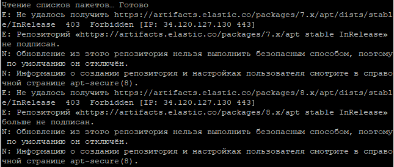

# Дипломная работа на тему "Система релевантного поиска товаров на основе ElasticSearch"

## Установка

При установке ElasticSearch столкнулся со следующей проблемой:



Причина заключается в следующем:


Выход из сложившейся систуации - установка ElasticSearch в контейнере Docker. Причём, образ новешей версии
не доступен, пришлось использовать версию 7.5.2. Установка Docker-образа:

```

docker run -d --name elasticsearch -p 9200:9200 -p 9300:9300 -e "discovery.type=single-node" -e ELASTIC_USERNAME=elastic -e ELASTIC_PASSWORD=Elastic$12345 elasticsearch:7.5.2

```

## Проверка работоспособности

HTTP запрос проверки работоспособности:

```

GET http://ese.group.legion.ru:9200/_cluster/health

```

Ответ:

```

{
    "cluster_name": "docker-cluster",
    "status": "green",
    "timed_out": false,
    "number_of_nodes": 1,
    "number_of_data_nodes": 1,
    "active_primary_shards": 0,
    "active_shards": 0,
    "relocating_shards": 0,
    "initializing_shards": 0,
    "unassigned_shards": 0,
    "delayed_unassigned_shards": 0,
    "number_of_pending_tasks": 0,
    "number_of_in_flight_fetch": 0,
    "task_max_waiting_in_queue_millis": 0,
    "active_shards_percent_as_number": 100.0
}

```
