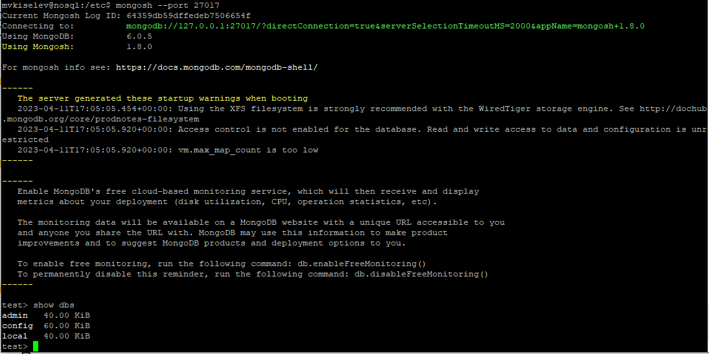
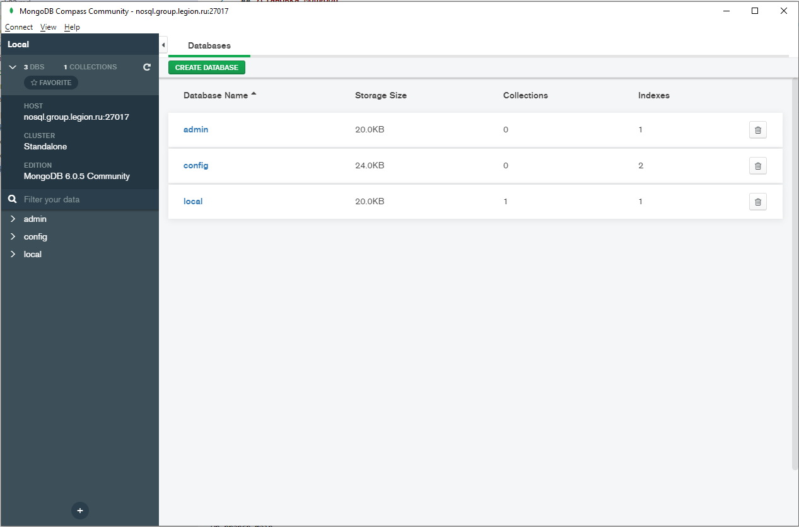
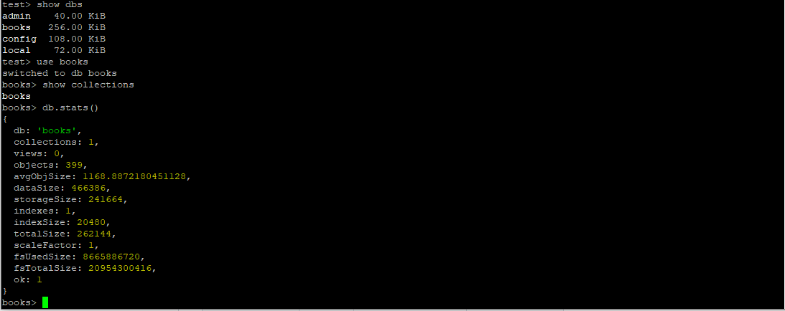
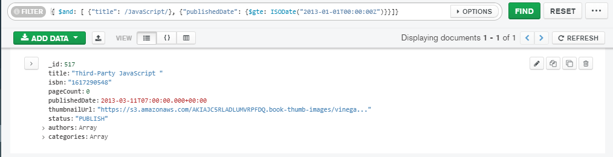
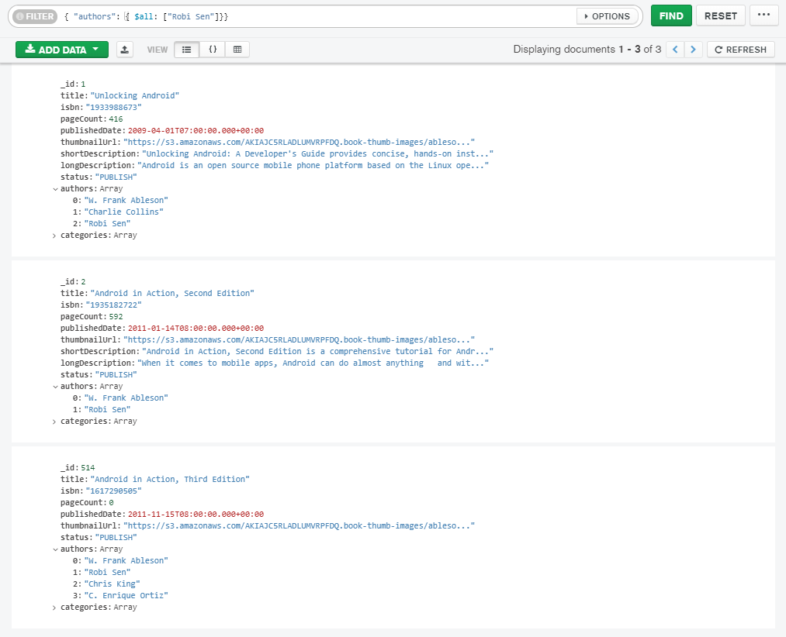
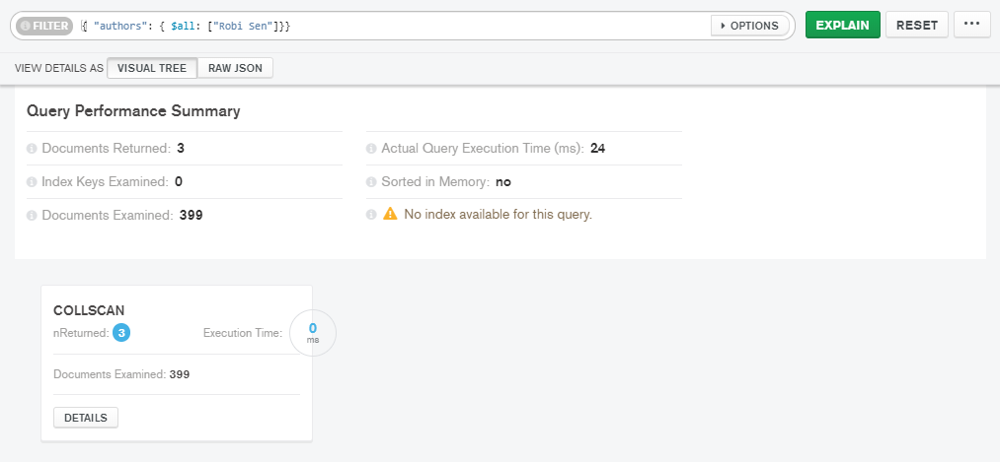
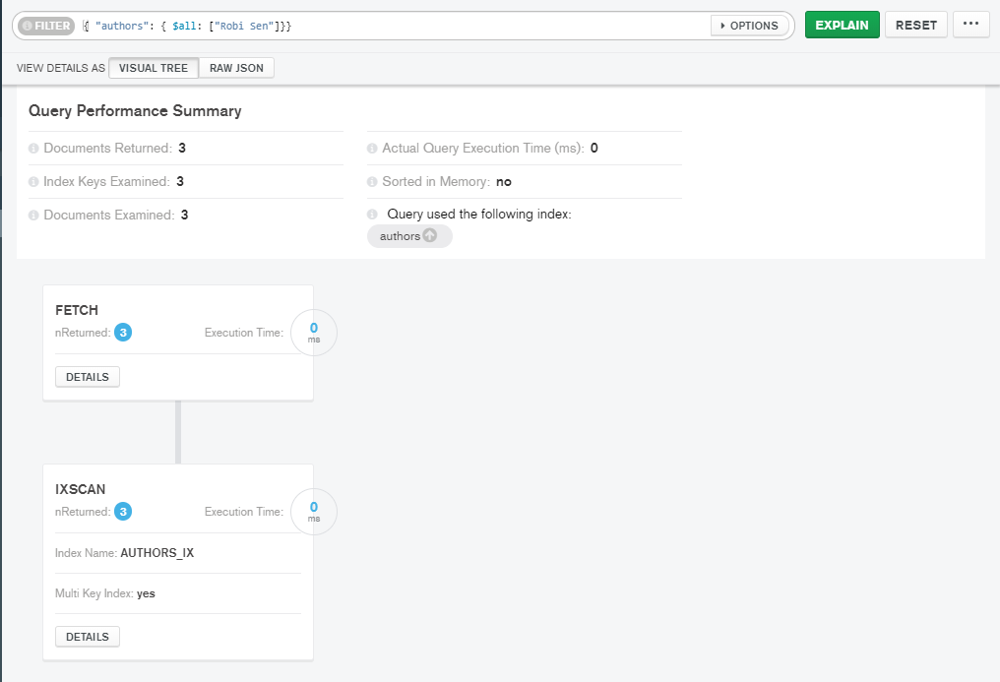
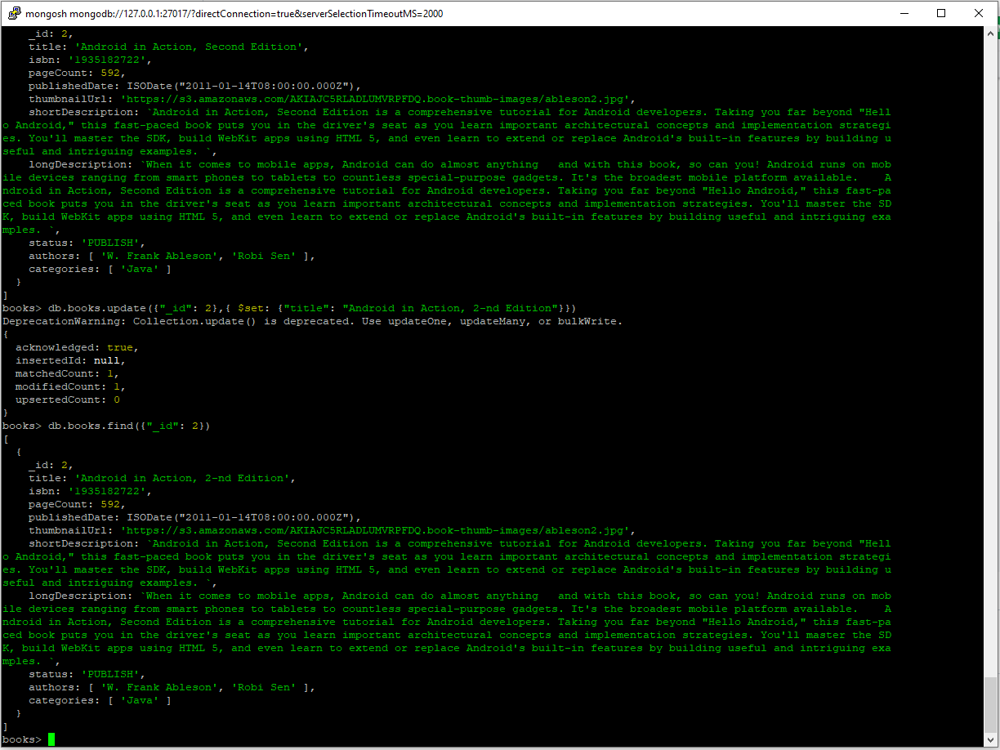

# Домашнее задание по теме "Базовые возможности MongoDB"
## Установка MongoDB
Установку производил согласно [инструкции](https://www.mongodb.com/docs/manual/tutorial/install-mongodb-on-ubuntu/). Предложенный
в материалах к занятию скрипт установки выполнить не удалось. Видимо, из-за различий в версии ОС. Ниже на скриншотах
представлено состояние сервиса mongod и запущенная консоль mongosh.

Для подключения и работы с MongoDB я использовал MongoDB Compass Community:

Загрузил данные о книгах с предложенного [ресурса](https://github.com/ozlerhakan/mongodb-json-files). Загрузку произвёл средствами
импорта данных MongoDB Compass Community. Состояние после загрузки:

## Запросы на выборку
### Запрос на выборку книг по JavaScript, выпущенных начиная с 01.01.2013 включительно

### Запрос на выборку книг, автором которых, является Robi Sen

План выполнения запроса:

После добавления индекса по полю Authors, план выглядит так:

Видно, что после создания индекса по полю Authors, актуальное время выполнения запроса поиска книг по автору
изменилось драматически: с 24ms до 0ms.

## Запрос на обновление

Изменение названия книги с _id: 2. Исходное название: "Android in Action, Second Edition",
после обновления: "Android in Action, 2-nd Edition"

