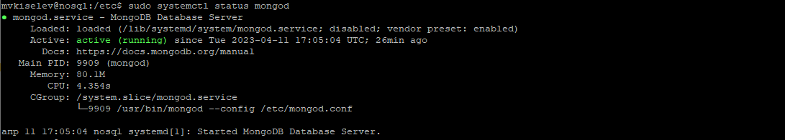

# Домашнее задание по теме "Базовые возможности MongoDB"
## Установка MongoDB
Установку производил согласно [инструкции](https://www.mongodb.com/docs/manual/tutorial/install-mongodb-on-ubuntu/). Предложенный
в материалах к занятию скрипт установки выполнить не удалось. Видимо, из-за различий в версии ОС. Ниже на скриншотах
представлено состояние сервиса mongod и запущенная консоль mongosh.

