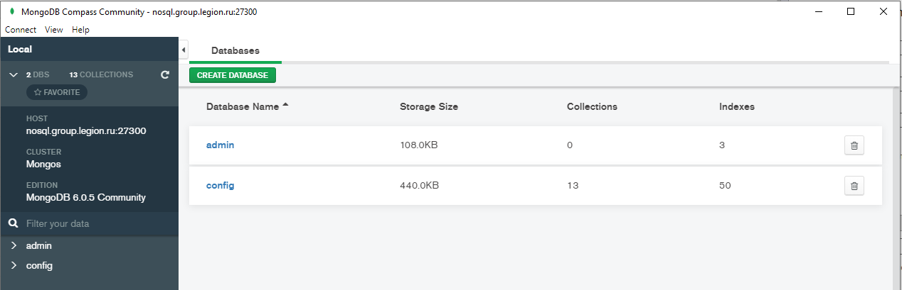
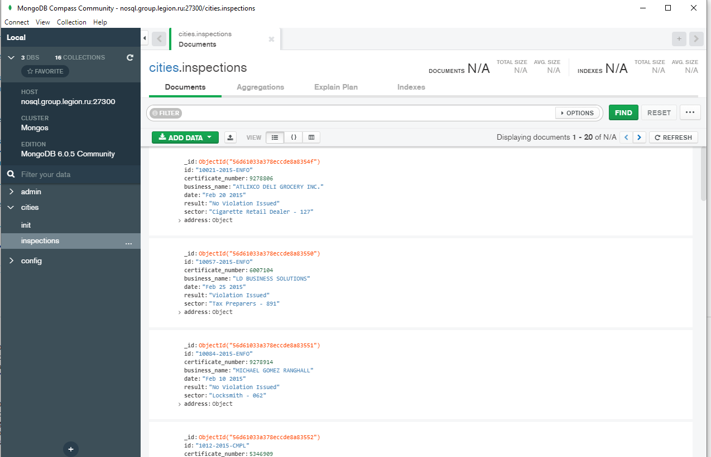

# Домашнее задание по теме "Кластерные возможности MongoDB"
## Содание набора реплик конфигурации

### Запуск процессов

```sudo mkdir /home/mongo && sudo mkdir /home/mongo/{dbc1,dbc2,dbc3} && sudo chmod 777 /home/mongo/{dbc1,dbc2,dbc3}
mongod --configsvr --dbpath /home/mongo/dbc1 --port 27001 --replSet RScfg --fork --logpath /home/mongo/dbc1/dbc1.log --pidfilepath /home/mongo/dbc1/dbc1.pid
mongod --configsvr --dbpath /home/mongo/dbc2 --port 27002 --replSet RScfg --fork --logpath /home/mongo/dbc2/dbc2.log --pidfilepath /home/mongo/dbc2/dbc2.pid
mongod --configsvr --dbpath /home/mongo/dbc3 --port 27003 --replSet RScfg --fork --logpath /home/mongo/dbc3/dbc3.log --pidfilepath /home/mongo/dbc3/dbc3.pid

### Проверка успешного запуска процессов:

ps aux | grep mongo| grep -Ev "grep"

### Создание набора реплик:

```mongosh --port 27001
> rs.initiate({"_id" : "RScfg", configsvr: true, members : [{"_id" : 0, priority : 3, host : "127.0.0.1:27001"},{"_id" : 1, host : "127.0.0.1:27002"},{"_id" : 2, host : "127.0.0.1:27003"}]});
> rs.status()
```

Ниже представлено состояния набора реплик конфигурации

```{
  set: 'RScfg',
  date: ISODate("2023-04-20T16:56:01.873Z"),
  myState: 1,
  term: Long("1"),
  syncSourceHost: '',
  syncSourceId: -1,
  configsvr: true,
  heartbeatIntervalMillis: Long("2000"),
  majorityVoteCount: 2,
  writeMajorityCount: 2,
  votingMembersCount: 3,
  writableVotingMembersCount: 3,
  optimes: {
    lastCommittedOpTime: { ts: Timestamp({ t: 1682009761, i: 1 }), t: Long("1") },
    lastCommittedWallTime: ISODate("2023-04-20T16:56:01.203Z"),
    readConcernMajorityOpTime: { ts: Timestamp({ t: 1682009761, i: 1 }), t: Long("1") },
    appliedOpTime: { ts: Timestamp({ t: 1682009761, i: 1 }), t: Long("1") },
    durableOpTime: { ts: Timestamp({ t: 1682009761, i: 1 }), t: Long("1") },
    lastAppliedWallTime: ISODate("2023-04-20T16:56:01.203Z"),
    lastDurableWallTime: ISODate("2023-04-20T16:56:01.203Z")
  },
  lastStableRecoveryTimestamp: Timestamp({ t: 1682009755, i: 1 }),
  electionCandidateMetrics: {
    lastElectionReason: 'electionTimeout',
    lastElectionDate: ISODate("2023-04-20T16:51:06.945Z"),
    electionTerm: Long("1"),
    lastCommittedOpTimeAtElection: { ts: Timestamp({ t: 1682009455, i: 1 }), t: Long("-1") },
    lastSeenOpTimeAtElection: { ts: Timestamp({ t: 1682009455, i: 1 }), t: Long("-1") },
    numVotesNeeded: 2,
    priorityAtElection: 3,
    electionTimeoutMillis: Long("10000"),
    numCatchUpOps: Long("0"),
    newTermStartDate: ISODate("2023-04-20T16:51:07.014Z"),
    wMajorityWriteAvailabilityDate: ISODate("2023-04-20T16:51:08.154Z")
  },
  members: [
    {
      _id: 0,
      name: '127.0.0.1:27001',
      health: 1,
      state: 1,
      stateStr: 'PRIMARY',
      uptime: 624,
      optime: { ts: Timestamp({ t: 1682009761, i: 1 }), t: Long("1") },
      optimeDate: ISODate("2023-04-20T16:56:01.000Z"),
      lastAppliedWallTime: ISODate("2023-04-20T16:56:01.203Z"),
      lastDurableWallTime: ISODate("2023-04-20T16:56:01.203Z"),
      syncSourceHost: '',
      syncSourceId: -1,
      infoMessage: '',
      electionTime: Timestamp({ t: 1682009466, i: 1 }),
      electionDate: ISODate("2023-04-20T16:51:06.000Z"),
      configVersion: 1,
      configTerm: 1,
      self: true,
      lastHeartbeatMessage: ''
    },
    {
      _id: 1,
      name: '127.0.0.1:27002',
      health: 1,
      state: 2,
      stateStr: 'SECONDARY',
      uptime: 306,
      optime: { ts: Timestamp({ t: 1682009760, i: 1 }), t: Long("1") },
      optimeDurable: { ts: Timestamp({ t: 1682009760, i: 1 }), t: Long("1") },
      optimeDate: ISODate("2023-04-20T16:56:00.000Z"),
      optimeDurableDate: ISODate("2023-04-20T16:56:00.000Z"),
      lastAppliedWallTime: ISODate("2023-04-20T16:56:01.203Z"),
      lastDurableWallTime: ISODate("2023-04-20T16:56:01.203Z"),
      lastHeartbeat: ISODate("2023-04-20T16:56:00.977Z"),
      lastHeartbeatRecv: ISODate("2023-04-20T16:56:00.455Z"),
      pingMs: Long("0"),
      lastHeartbeatMessage: '',
      syncSourceHost: '127.0.0.1:27001',
      syncSourceId: 0,
      infoMessage: '',
      configVersion: 1,
      configTerm: 1
    },
    {
      _id: 2,
      name: '127.0.0.1:27003',
      health: 1,
      state: 2,
      stateStr: 'SECONDARY',
      uptime: 306,
      optime: { ts: Timestamp({ t: 1682009760, i: 1 }), t: Long("1") },
      optimeDurable: { ts: Timestamp({ t: 1682009760, i: 1 }), t: Long("1") },
      optimeDate: ISODate("2023-04-20T16:56:00.000Z"),
      optimeDurableDate: ISODate("2023-04-20T16:56:00.000Z"),
      lastAppliedWallTime: ISODate("2023-04-20T16:56:01.203Z"),
      lastDurableWallTime: ISODate("2023-04-20T16:56:01.203Z"),
      lastHeartbeat: ISODate("2023-04-20T16:56:00.977Z"),
      lastHeartbeatRecv: ISODate("2023-04-20T16:56:00.465Z"),
      pingMs: Long("0"),
      lastHeartbeatMessage: '',
      syncSourceHost: '127.0.0.1:27001',
      syncSourceId: 0,
      infoMessage: '',
      configVersion: 1,
      configTerm: 1
    }
  ],
  ok: 1,
  lastCommittedOpTime: Timestamp({ t: 1682009761, i: 1 }),
  '$clusterTime': {
    clusterTime: Timestamp({ t: 1682009761, i: 1 }),
    signature: {
      hash: Binary(Buffer.from("0000000000000000000000000000000000000000", "hex"), 0),
      keyId: Long("0")
    }
  },
  operationTime: Timestamp({ t: 1682009761, i: 1 })
}
```
## Создание наборов реплик (3 набор по 3 реплики)

### Запуск процессов

```sudo mkdir /home/mongo/{db1,db2,db3,db4,db5,db6,db7,db8,db9} && sudo chmod 777 /home/mongo/{db1,db2,db3,db4,db5,db6,db7,db8,db9}
mongod --shardsvr --dbpath /home/mongo/db1 --port 27011 --replSet RS1 --fork --logpath /home/mongo/db1/db1.log --pidfilepath /home/mongo/db1/db1.pid
mongod --shardsvr --dbpath /home/mongo/db2 --port 27012 --replSet RS1 --fork --logpath /home/mongo/db2/db2.log --pidfilepath /home/mongo/db2/db2.pid
mongod --shardsvr --dbpath /home/mongo/db3 --port 27013 --replSet RS1 --fork --logpath /home/mongo/db3/db3.log --pidfilepath /home/mongo/db3/db3.pid

mongod --shardsvr --dbpath /home/mongo/db4 --port 27021 --replSet RS2 --fork --logpath /home/mongo/db4/db4.log --pidfilepath /home/mongo/db4/db4.pid
mongod --shardsvr --dbpath /home/mongo/db5 --port 27022 --replSet RS2 --fork --logpath /home/mongo/db5/db5.log --pidfilepath /home/mongo/db5/db5.pid
mongod --shardsvr --dbpath /home/mongo/db6 --port 27023 --replSet RS2 --fork --logpath /home/mongo/db6/db6.log --pidfilepath /home/mongo/db6/db6.pid

mongod --shardsvr --dbpath /home/mongo/db7 --port 27031 --replSet RS3 --fork --logpath /home/mongo/db7/db7.log --pidfilepath /home/mongo/db7/db7.pid
mongod --shardsvr --dbpath /home/mongo/db8 --port 27032 --replSet RS3 --fork --logpath /home/mongo/db8/db8.log --pidfilepath /home/mongo/db8/db8.pid
mongod --shardsvr --dbpath /home/mongo/db9 --port 27033 --replSet RS3 --fork --logpath /home/mongo/db9/db9.log --pidfilepath /home/mongo/db9/db9.pid
```
Проверка успешного запуска процессов:

ps aux | grep mongo| grep -Ev "grep"

```root        2090  0.5  5.3 3021948 53232 ?       Sl   16:45   0:09 mongod --configsvr --dbpath /home/mongo/dbc1 --port 27001 --replSet RScfg --fork --logpath /home/mongo/dbc1/dbc1.log --pidfilepath /home/mongo/dbc1/dbc1.pid
root        2153  0.5  5.0 2993784 50112 ?       Sl   16:48   0:07 mongod --configsvr --dbpath /home/mongo/dbc2 --port 27002 --replSet RScfg --fork --logpath /home/mongo/dbc2/dbc2.log --pidfilepath /home/mongo/dbc2/dbc2.pid
root        2218  0.5  5.2 2989824 52048 ?       Sl   16:48   0:07 mongod --configsvr --dbpath /home/mongo/dbc3 --port 27003 --replSet RScfg --fork --logpath /home/mongo/dbc3/dbc3.log --pidfilepath /home/mongo/dbc3/dbc3.pid
root        2467  0.7  9.1 2798920 90596 ?       Sl   17:07   0:01 mongod --shardsvr --dbpath /home/mongo/db1 --port 27011 --replSet RS1 --fork --logpath /home/mongo/db1/db1.log --pidfilepath /home/mongo/db1/db1.pid
root        2533  0.7  9.1 2798920 90664 ?       Sl   17:08   0:01 mongod --shardsvr --dbpath /home/mongo/db2 --port 27012 --replSet RS1 --fork --logpath /home/mongo/db2/db2.log --pidfilepath /home/mongo/db2/db2.pid
root        2596  0.8  9.1 2797120 90384 ?       Sl   17:08   0:01 mongod --shardsvr --dbpath /home/mongo/db3 --port 27013 --replSet RS1 --fork --logpath /home/mongo/db3/db3.log --pidfilepath /home/mongo/db3/db3.pid
root        2662  0.8  9.1 2797120 91072 ?       Sl   17:09   0:01 mongod --shardsvr --dbpath /home/mongo/db4 --port 27021 --replSet RS2 --fork --logpath /home/mongo/db4/db4.log --pidfilepath /home/mongo/db4/db4.pid
root        2726  0.9  9.0 2797120 90144 ?       Sl   17:09   0:01 mongod --shardsvr --dbpath /home/mongo/db5 --port 27022 --replSet RS2 --fork --logpath /home/mongo/db5/db5.log --pidfilepath /home/mongo/db5/db5.pid
root        2789  1.0  9.8 2797120 97988 ?       Sl   17:10   0:00 mongod --shardsvr --dbpath /home/mongo/db6 --port 27023 --replSet RS2 --fork --logpath /home/mongo/db6/db6.log --pidfilepath /home/mongo/db6/db6.pid
root        2852  1.2  9.8 2796096 97752 ?       Sl   17:10   0:00 mongod --shardsvr --dbpath /home/mongo/db7 --port 27031 --replSet RS3 --fork --logpath /home/mongo/db7/db7.log --pidfilepath /home/mongo/db7/db7.pid
root        2917  1.5  9.6 2796096 95828 ?       Sl   17:10   0:00 mongod --shardsvr --dbpath /home/mongo/db8 --port 27032 --replSet RS3 --fork --logpath /home/mongo/db8/db8.log --pidfilepath /home/mongo/db8/db8.pid
root        2980  2.4  9.6 2795072 95404 ?       Sl   17:11   0:00 mongod --shardsvr --dbpath /home/mongo/db9 --port 27033 --replSet RS3 --fork --logpath /home/mongo/db9/db9.log --pidfilepath /home/mongo/db9/db9.pid
```

### Конфигурирование набора реплик первого шарда

```mongosh --port 27011
> rs.initiate({"_id" : "RS1", members : [{"_id" : 0, priority : 3, host : "127.0.0.1:27011"},{"_id" : 1, host : "127.0.0.1:27012"},{"_id" : 2, host : "127.0.0.1:27013"}]});

{
  set: 'RS1',
  date: ISODate("2023-04-20T17:16:50.773Z"),
  myState: 1,
  term: Long("1"),
  syncSourceHost: '',
  syncSourceId: -1,
  heartbeatIntervalMillis: Long("2000"),
  majorityVoteCount: 2,
  writeMajorityCount: 2,
  votingMembersCount: 3,
  writableVotingMembersCount: 3,
  optimes: {
    lastCommittedOpTime: { ts: Timestamp({ t: 1682011006, i: 1 }), t: Long("1") },
    lastCommittedWallTime: ISODate("2023-04-20T17:16:46.681Z"),
    readConcernMajorityOpTime: { ts: Timestamp({ t: 1682011006, i: 1 }), t: Long("1") },
    appliedOpTime: { ts: Timestamp({ t: 1682011006, i: 1 }), t: Long("1") },
    durableOpTime: { ts: Timestamp({ t: 1682011006, i: 1 }), t: Long("1") },
    lastAppliedWallTime: ISODate("2023-04-20T17:16:46.681Z"),
    lastDurableWallTime: ISODate("2023-04-20T17:16:46.681Z")
  },
  lastStableRecoveryTimestamp: Timestamp({ t: 1682010975, i: 1 }),
  electionCandidateMetrics: {
    lastElectionReason: 'electionTimeout',
    lastElectionDate: ISODate("2023-04-20T17:16:26.339Z"),
    electionTerm: Long("1"),
    lastCommittedOpTimeAtElection: { ts: Timestamp({ t: 1682010975, i: 1 }), t: Long("-1") },
    lastSeenOpTimeAtElection: { ts: Timestamp({ t: 1682010975, i: 1 }), t: Long("-1") },
    numVotesNeeded: 2,
    priorityAtElection: 3,
    electionTimeoutMillis: Long("10000"),
    numCatchUpOps: Long("0"),
    newTermStartDate: ISODate("2023-04-20T17:16:26.530Z"),
    wMajorityWriteAvailabilityDate: ISODate("2023-04-20T17:16:27.647Z")
  },
  members: [
    {
      _id: 0,
      name: '127.0.0.1:27011',
      health: 1,
      state: 1,
      stateStr: 'PRIMARY',
      uptime: 531,
      optime: { ts: Timestamp({ t: 1682011006, i: 1 }), t: Long("1") },
      optimeDate: ISODate("2023-04-20T17:16:46.000Z"),
      lastAppliedWallTime: ISODate("2023-04-20T17:16:46.681Z"),
      lastDurableWallTime: ISODate("2023-04-20T17:16:46.681Z"),
      syncSourceHost: '',
      syncSourceId: -1,
      infoMessage: '',
      electionTime: Timestamp({ t: 1682010986, i: 1 }),
      electionDate: ISODate("2023-04-20T17:16:26.000Z"),
      configVersion: 1,
      configTerm: 1,
      self: true,
      lastHeartbeatMessage: ''
    },
    {
      _id: 1,
      name: '127.0.0.1:27012',
      health: 1,
      state: 2,
      stateStr: 'SECONDARY',
      uptime: 35,
      optime: { ts: Timestamp({ t: 1682011006, i: 1 }), t: Long("1") },
      optimeDurable: { ts: Timestamp({ t: 1682011006, i: 1 }), t: Long("1") },
      optimeDate: ISODate("2023-04-20T17:16:46.000Z"),
      optimeDurableDate: ISODate("2023-04-20T17:16:46.000Z"),
      lastAppliedWallTime: ISODate("2023-04-20T17:16:46.681Z"),
      lastDurableWallTime: ISODate("2023-04-20T17:16:46.681Z"),
      lastHeartbeat: ISODate("2023-04-20T17:16:50.458Z"),
      lastHeartbeatRecv: ISODate("2023-04-20T17:16:49.982Z"),
      pingMs: Long("0"),
      lastHeartbeatMessage: '',
      syncSourceHost: '127.0.0.1:27011',
      syncSourceId: 0,
      infoMessage: '',
      configVersion: 1,
      configTerm: 1
    },
    {
      _id: 2,
      name: '127.0.0.1:27013',
      health: 1,
      state: 2,
      stateStr: 'SECONDARY',
      uptime: 35,
      optime: { ts: Timestamp({ t: 1682011006, i: 1 }), t: Long("1") },
      optimeDurable: { ts: Timestamp({ t: 1682011006, i: 1 }), t: Long("1") },
      optimeDate: ISODate("2023-04-20T17:16:46.000Z"),
      optimeDurableDate: ISODate("2023-04-20T17:16:46.000Z"),
      lastAppliedWallTime: ISODate("2023-04-20T17:16:46.681Z"),
      lastDurableWallTime: ISODate("2023-04-20T17:16:46.681Z"),
      lastHeartbeat: ISODate("2023-04-20T17:16:50.441Z"),
      lastHeartbeatRecv: ISODate("2023-04-20T17:16:49.935Z"),
      pingMs: Long("0"),
      lastHeartbeatMessage: '',
      syncSourceHost: '127.0.0.1:27011',
      syncSourceId: 0,
      infoMessage: '',
      configVersion: 1,
      configTerm: 1
    }
  ],
  ok: 1,
  '$clusterTime': {
    clusterTime: Timestamp({ t: 1682011006, i: 1 }),
    signature: {
      hash: Binary(Buffer.from("0000000000000000000000000000000000000000", "hex"), 0),
      keyId: Long("0")
    }
  },
  operationTime: Timestamp({ t: 1682011006, i: 1 })
}
```
### Конфигурирование набора реплик второго шарда

```mongosh --port 27021
> rs.initiate({"_id" : "RS2", members : [{"_id" : 0, priority : 3, host : "127.0.0.1:27021"},{"_id" : 1, host : "127.0.0.1:27022"},{"_id" : 2, host : "127.0.0.1:27023"}]});

{
  set: 'RS2',
  date: ISODate("2023-04-20T17:20:18.530Z"),
  myState: 1,
  term: Long("1"),
  syncSourceHost: '',
  syncSourceId: -1,
  heartbeatIntervalMillis: Long("2000"),
  majorityVoteCount: 2,
  writeMajorityCount: 2,
  votingMembersCount: 3,
  writableVotingMembersCount: 3,
  optimes: {
    lastCommittedOpTime: { ts: Timestamp({ t: 1682011215, i: 6 }), t: Long("1") },
    lastCommittedWallTime: ISODate("2023-04-20T17:20:15.371Z"),
    readConcernMajorityOpTime: { ts: Timestamp({ t: 1682011215, i: 6 }), t: Long("1") },
    appliedOpTime: { ts: Timestamp({ t: 1682011215, i: 6 }), t: Long("1") },
    durableOpTime: { ts: Timestamp({ t: 1682011215, i: 6 }), t: Long("1") },
    lastAppliedWallTime: ISODate("2023-04-20T17:20:15.371Z"),
    lastDurableWallTime: ISODate("2023-04-20T17:20:15.371Z")
  },
  lastStableRecoveryTimestamp: Timestamp({ t: 1682011204, i: 1 }),
  electionCandidateMetrics: {
    lastElectionReason: 'electionTimeout',
    lastElectionDate: ISODate("2023-04-20T17:20:14.667Z"),
    electionTerm: Long("1"),
    lastCommittedOpTimeAtElection: { ts: Timestamp({ t: 1682011204, i: 1 }), t: Long("-1") },
    lastSeenOpTimeAtElection: { ts: Timestamp({ t: 1682011204, i: 1 }), t: Long("-1") },
    numVotesNeeded: 2,
    priorityAtElection: 3,
    electionTimeoutMillis: Long("10000"),
    numCatchUpOps: Long("0"),
    newTermStartDate: ISODate("2023-04-20T17:20:14.708Z"),
    wMajorityWriteAvailabilityDate: ISODate("2023-04-20T17:20:15.233Z")
  },
  members: [
    {
      _id: 0,
      name: '127.0.0.1:27021',
      health: 1,
      state: 1,
      stateStr: 'PRIMARY',
      uptime: 669,
      optime: { ts: Timestamp({ t: 1682011215, i: 6 }), t: Long("1") },
      optimeDate: ISODate("2023-04-20T17:20:15.000Z"),
      lastAppliedWallTime: ISODate("2023-04-20T17:20:15.371Z"),
      lastDurableWallTime: ISODate("2023-04-20T17:20:15.371Z"),
      syncSourceHost: '',
      syncSourceId: -1,
      infoMessage: 'Could not find member to sync from',
      electionTime: Timestamp({ t: 1682011214, i: 1 }),
      electionDate: ISODate("2023-04-20T17:20:14.000Z"),
      configVersion: 1,
      configTerm: 1,
      self: true,
      lastHeartbeatMessage: ''
    },
    {
      _id: 1,
      name: '127.0.0.1:27022',
      health: 1,
      state: 2,
      stateStr: 'SECONDARY',
      uptime: 14,
      optime: { ts: Timestamp({ t: 1682011215, i: 6 }), t: Long("1") },
      optimeDurable: { ts: Timestamp({ t: 1682011215, i: 6 }), t: Long("1") },
      optimeDate: ISODate("2023-04-20T17:20:15.000Z"),
      optimeDurableDate: ISODate("2023-04-20T17:20:15.000Z"),
      lastAppliedWallTime: ISODate("2023-04-20T17:20:15.371Z"),
      lastDurableWallTime: ISODate("2023-04-20T17:20:15.371Z"),
      lastHeartbeat: ISODate("2023-04-20T17:20:16.694Z"),
      lastHeartbeatRecv: ISODate("2023-04-20T17:20:17.696Z"),
      pingMs: Long("0"),
      lastHeartbeatMessage: '',
      syncSourceHost: '127.0.0.1:27021',
      syncSourceId: 0,
      infoMessage: '',
      configVersion: 1,
      configTerm: 1
    },
    {
      _id: 2,
      name: '127.0.0.1:27023',
      health: 1,
      state: 2,
      stateStr: 'SECONDARY',
      uptime: 14,
      optime: { ts: Timestamp({ t: 1682011215, i: 6 }), t: Long("1") },
      optimeDurable: { ts: Timestamp({ t: 1682011215, i: 6 }), t: Long("1") },
      optimeDate: ISODate("2023-04-20T17:20:15.000Z"),
      optimeDurableDate: ISODate("2023-04-20T17:20:15.000Z"),
      lastAppliedWallTime: ISODate("2023-04-20T17:20:15.371Z"),
      lastDurableWallTime: ISODate("2023-04-20T17:20:15.371Z"),
      lastHeartbeat: ISODate("2023-04-20T17:20:16.694Z"),
      lastHeartbeatRecv: ISODate("2023-04-20T17:20:17.697Z"),
      pingMs: Long("0"),
      lastHeartbeatMessage: '',
      syncSourceHost: '127.0.0.1:27021',
      syncSourceId: 0,
      infoMessage: '',
      configVersion: 1,
      configTerm: 1
    }
  ],
  ok: 1,
  '$clusterTime': {
    clusterTime: Timestamp({ t: 1682011215, i: 6 }),
    signature: {
      hash: Binary(Buffer.from("0000000000000000000000000000000000000000", "hex"), 0),
      keyId: Long("0")
    }
  },
  operationTime: Timestamp({ t: 1682011215, i: 6 })
}
```

### Конфигурирование набора реплик третьего шарда

```mongosh --port 27031
> rs.initiate({"_id" : "RS3", members : [{"_id" : 0, priority : 3, host : "127.0.0.1:27031"},{"_id" : 1, host : "127.0.0.1:27032"},{"_id" : 2, host : "127.0.0.1:27033"}]});

{
  set: 'RS3',
  date: ISODate("2023-04-20T17:23:05.581Z"),
  myState: 1,
  term: Long("1"),
  syncSourceHost: '',
  syncSourceId: -1,
  heartbeatIntervalMillis: Long("2000"),
  majorityVoteCount: 2,
  writeMajorityCount: 2,
  votingMembersCount: 3,
  writableVotingMembersCount: 3,
  optimes: {
    lastCommittedOpTime: { ts: Timestamp({ t: 1682011385, i: 6 }), t: Long("1") },
    lastCommittedWallTime: ISODate("2023-04-20T17:23:05.232Z"),
    readConcernMajorityOpTime: { ts: Timestamp({ t: 1682011385, i: 6 }), t: Long("1") },
    appliedOpTime: { ts: Timestamp({ t: 1682011385, i: 6 }), t: Long("1") },
    durableOpTime: { ts: Timestamp({ t: 1682011385, i: 6 }), t: Long("1") },
    lastAppliedWallTime: ISODate("2023-04-20T17:23:05.232Z"),
    lastDurableWallTime: ISODate("2023-04-20T17:23:05.232Z")
  },
  lastStableRecoveryTimestamp: Timestamp({ t: 1682011372, i: 1 }),
  electionCandidateMetrics: {
    lastElectionReason: 'electionTimeout',
    lastElectionDate: ISODate("2023-04-20T17:23:04.196Z"),
    electionTerm: Long("1"),
    lastCommittedOpTimeAtElection: { ts: Timestamp({ t: 1682011372, i: 1 }), t: Long("-1") },
    lastSeenOpTimeAtElection: { ts: Timestamp({ t: 1682011372, i: 1 }), t: Long("-1") },
    numVotesNeeded: 2,
    priorityAtElection: 3,
    electionTimeoutMillis: Long("10000"),
    numCatchUpOps: Long("0"),
    newTermStartDate: ISODate("2023-04-20T17:23:04.223Z"),
    wMajorityWriteAvailabilityDate: ISODate("2023-04-20T17:23:05.029Z")
  },
  members: [
    {
      _id: 0,
      name: '127.0.0.1:27031',
      health: 1,
      state: 1,
      stateStr: 'PRIMARY',
      uptime: 761,
      optime: { ts: Timestamp({ t: 1682011385, i: 6 }), t: Long("1") },
      optimeDate: ISODate("2023-04-20T17:23:05.000Z"),
      lastAppliedWallTime: ISODate("2023-04-20T17:23:05.232Z"),
      lastDurableWallTime: ISODate("2023-04-20T17:23:05.232Z"),
      syncSourceHost: '',
      syncSourceId: -1,
      infoMessage: 'Could not find member to sync from',
      electionTime: Timestamp({ t: 1682011384, i: 1 }),
      electionDate: ISODate("2023-04-20T17:23:04.000Z"),
      configVersion: 1,
      configTerm: 1,
      self: true,
      lastHeartbeatMessage: ''
    },
    {
      _id: 1,
      name: '127.0.0.1:27032',
      health: 1,
      state: 2,
      stateStr: 'SECONDARY',
      uptime: 12,
      optime: { ts: Timestamp({ t: 1682011372, i: 1 }), t: Long("-1") },
      optimeDurable: { ts: Timestamp({ t: 1682011372, i: 1 }), t: Long("-1") },
      optimeDate: ISODate("2023-04-20T17:22:52.000Z"),
      optimeDurableDate: ISODate("2023-04-20T17:22:52.000Z"),
      lastAppliedWallTime: ISODate("2023-04-20T17:23:05.232Z"),
      lastDurableWallTime: ISODate("2023-04-20T17:23:05.232Z"),
      lastHeartbeat: ISODate("2023-04-20T17:23:04.213Z"),
      lastHeartbeatRecv: ISODate("2023-04-20T17:23:05.216Z"),
      pingMs: Long("0"),
      lastHeartbeatMessage: '',
      syncSourceHost: '',
      syncSourceId: -1,
      infoMessage: '',
      configVersion: 1,
      configTerm: 0
    },
    {
      _id: 2,
      name: '127.0.0.1:27033',
      health: 1,
      state: 2,
      stateStr: 'SECONDARY',
      uptime: 12,
      optime: { ts: Timestamp({ t: 1682011372, i: 1 }), t: Long("-1") },
      optimeDurable: { ts: Timestamp({ t: 1682011372, i: 1 }), t: Long("-1") },
      optimeDate: ISODate("2023-04-20T17:22:52.000Z"),
      optimeDurableDate: ISODate("2023-04-20T17:22:52.000Z"),
      lastAppliedWallTime: ISODate("2023-04-20T17:23:05.232Z"),
      lastDurableWallTime: ISODate("2023-04-20T17:23:05.232Z"),
      lastHeartbeat: ISODate("2023-04-20T17:23:04.213Z"),
      lastHeartbeatRecv: ISODate("2023-04-20T17:23:05.215Z"),
      pingMs: Long("0"),
      lastHeartbeatMessage: '',
      syncSourceHost: '',
      syncSourceId: -1,
      infoMessage: '',
      configVersion: 1,
      configTerm: 0
    }
  ],
  ok: 1,
  '$clusterTime': {
    clusterTime: Timestamp({ t: 1682011385, i: 6 }),
    signature: {
      hash: Binary(Buffer.from("0000000000000000000000000000000000000000", "hex"), 0),
      keyId: Long("0")
    }
  },
  operationTime: Timestamp({ t: 1682011385, i: 6 })
}
```
## Запуск роутеров

sudo mkdir /home/mongo/dbs && sudo chmod 777 /home/mongo/dbs

```mongos --configdb RScfg/127.0.0.1:27001,127.0.0.1:27002,127.0.0.1:27003 --port 27100 --fork --logpath /home/mongo/dbs/dbs1.log --pidfilepath /home/mongo/dbs/dbs1.pid --bind_ip_all
mongos --configdb RScfg/127.0.0.1:27001,127.0.0.1:27002,127.0.0.1:27003 --port 27200 --fork --logpath /home/mongo/dbs/dbs2.log --pidfilepath /home/mongo/dbs/dbs2.pid --bind_ip_all
```
Здесь очень важно указать --bind_ip_all. Иначе невозможно будет подключиться к кластеру с помощью внешних инструментов, например, MongoDB Compass Community.

## Конфигурирование шард

```mongosh --port 27100
> sh.addShard("RS1/127.0.0.1:27011,127.0.0.1:27012,127.0.0.1:27013")
> sh.addShard("RS2/127.0.0.1:27021,127.0.0.1:27022,127.0.0.1:27023")
> sh.addShard("RS3/127.0.0.1:27031,127.0.0.1:27032,127.0.0.1:27033")
> sh.status()
```
```
shardingVersion
{
  _id: 1,
  minCompatibleVersion: 5,
  currentVersion: 6,
  clusterId: ObjectId("64416d7bbfd6f6d4ef72e785")
}
shards
[
  {
    _id: 'RS1',
    host: 'RS1/127.0.0.1:27011,127.0.0.1:27012,127.0.0.1:27013',
    state: 1,
    topologyTime: Timestamp({ t: 1682012325, i: 1 })
  },
  {
    _id: 'RS2',
    host: 'RS2/127.0.0.1:27021,127.0.0.1:27022,127.0.0.1:27023',
    state: 1,
    topologyTime: Timestamp({ t: 1682012352, i: 1 })
  },
  {
    _id: 'RS3',
    host: 'RS3/127.0.0.1:27031,127.0.0.1:27032,127.0.0.1:27033',
    state: 1,
    topologyTime: Timestamp({ t: 1682012371, i: 1 })
  }
]
active mongoses
[ { '6.0.5': 2 } ]
autosplit
{ 'Currently enabled': 'yes' }
balancer
{
  'Currently enabled': 'yes',
  'Currently running': 'no',
  'Failed balancer rounds in last 5 attempts': 0,
  'Migration Results for the last 24 hours': 'No recent migrations'
}
databases
[
  {
    database: { _id: 'config', primary: 'config', partitioned: true },
    collections: {
      'config.system.sessions': {
        shardKey: { _id: 1 },
        unique: false,
        balancing: true,
        chunkMetadata: [ { shard: 'RS1', nChunks: 1024 } ],
        chunks: [
          'too many chunks to print, use verbose if you want to force print'
        ],
        tags: []
      }
    }
  }
]
```
## Список процессов

```root        2090  0.6  6.2 3108212 62244 ?       Sl   16:45   0:23 mongod --configsvr --dbpath /home/mongo/dbc1 --port 27001 --replSet RScfg --fork --logpath /home/mongo/dbc1/dbc1.log --pidfilepath /home/mongo/dbc1/dbc1.pid
root        2153  0.5  4.7 3063980 46672 ?       Sl   16:48   0:21 mongod --configsvr --dbpath /home/mongo/dbc2 --port 27002 --replSet RScfg --fork --logpath /home/mongo/dbc2/dbc2.log --pidfilepath /home/mongo/dbc2/dbc2.pid
root        2218  0.5  4.9 3075036 48704 ?       Sl   16:48   0:21 mongod --configsvr --dbpath /home/mongo/dbc3 --port 27003 --replSet RScfg --fork --logpath /home/mongo/dbc3/dbc3.log --pidfilepath /home/mongo/dbc3/dbc3.pid
root        2467  0.4  5.2 3144820 51852 ?       Sl   17:07   0:12 mongod --shardsvr --dbpath /home/mongo/db1 --port 27011 --replSet RS1 --fork --logpath /home/mongo/db1/db1.log --pidfilepath /home/mongo/db1/db1.pid
root        2533  0.4  4.6 3136604 46140 ?       Sl   17:08   0:11 mongod --shardsvr --dbpath /home/mongo/db2 --port 27012 --replSet RS1 --fork --logpath /home/mongo/db2/db2.log --pidfilepath /home/mongo/db2/db2.pid
root        2596  0.4  4.7 3126148 46708 ?       Sl   17:08   0:11 mongod --shardsvr --dbpath /home/mongo/db3 --port 27013 --replSet RS1 --fork --logpath /home/mongo/db3/db3.log --pidfilepath /home/mongo/db3/db3.pid
root        2662  0.4  5.0 3141896 49932 ?       Sl   17:09   0:12 mongod --shardsvr --dbpath /home/mongo/db4 --port 27021 --replSet RS2 --fork --logpath /home/mongo/db4/db4.log --pidfilepath /home/mongo/db4/db4.pid
root        2726  0.4  4.5 3128840 45096 ?       Sl   17:09   0:11 mongod --shardsvr --dbpath /home/mongo/db5 --port 27022 --replSet RS2 --fork --logpath /home/mongo/db5/db5.log --pidfilepath /home/mongo/db5/db5.pid
root        2789  0.4  4.6 3120852 46356 ?       Sl   17:10   0:11 mongod --shardsvr --dbpath /home/mongo/db6 --port 27023 --replSet RS2 --fork --logpath /home/mongo/db6/db6.log --pidfilepath /home/mongo/db6/db6.pid
root        2852  0.4  5.1 3133444 50744 ?       Sl   17:10   0:11 mongod --shardsvr --dbpath /home/mongo/db7 --port 27031 --replSet RS3 --fork --logpath /home/mongo/db7/db7.log --pidfilepath /home/mongo/db7/db7.pid
root        2917  0.4  4.5 3117540 44908 ?       Sl   17:10   0:10 mongod --shardsvr --dbpath /home/mongo/db8 --port 27032 --replSet RS3 --fork --logpath /home/mongo/db8/db8.log --pidfilepath /home/mongo/db8/db8.pid
root        2980  0.4  5.8 3109656 58468 ?       Sl   17:11   0:10 mongod --shardsvr --dbpath /home/mongo/db9 --port 27033 --replSet RS3 --fork --logpath /home/mongo/db9/db9.log --pidfilepath /home/mongo/db9/db9.pid
root        3449  0.1  3.4 2513688 34212 ?       Sl   17:34   0:01 mongos --configdb RScfg/127.0.0.1:27001,127.0.0.1:27002,127.0.0.1:27003 --port 27100 --fork --logpath /home/mongo/dbs/dbs1.log --pidfilepath /home/mongo/dbs/dbs1.pid
root        3498  0.1  3.0 2497780 30188 ?       Sl   17:34   0:01 mongos --configdb RScfg/127.0.0.1:27001,127.0.0.1:27002,127.0.0.1:27003 --port 27200 --fork --logpath /home/mongo/dbs/dbs2.log --pidfilepath /home/mongo/dbs/dbs2.pid
```

## Подключение к кластеру средствами MongoDB Compass Community



## Загрузка и шардирования данных

### Создание шардированной Базы Данных

```mongosh --port 27300
> use cities
> sh.enablingSharding("cities");
```
результат выполнения команды:

```{
  ok: 1,
  '$clusterTime': {
    clusterTime: Timestamp({ t: 1682076403, i: 2 }),
    signature: {
      hash: Binary(Buffer.from("0000000000000000000000000000000000000000", "hex"), 0),
      keyId: Long("0")
    }
  },
  operationTime: Timestamp({ t: 1682076402, i: 2 })
}
```
Изменение размера chunk:

```> use config
> db.settings.updateOne({ _id: 'chunksize' }, { $set: { _id: 'chunksize', value: 1 }}, { upsert: true });
```
результат выполнения команды:

```{
  acknowledged: true,
  insertedId: 'chunksize',
  matchedCount: 0,
  modifiedCount: 0,
  upsertedCount: 1
}
```
### Загрузка тестовых данных

Загрузил данные об инспекции городов с предложенного [ресурса](https://github.com/ozlerhakan/mongodb-json-files). Загрузку произвёл средствами
импорта данных MongoDB Compass Community. Состояние после загрузки:



### Выбор ключа шардирования

В качестве ключа шардирования выбрано поле business_name (название организации). Индекс по
указанному полю построен как hashed, поскольку хеширование равномерно распределит строки
по диапазаноу, даже если строки лингвистически близкие.

```
> db.inspections.createIndex({ business_name: "hashed" });
```

### Шардирование коллекции
```
> sh.shardCollection("cities.inspections", { business_name: "hashed" })
```
Результат выполнения команды:

```{
  collectionsharded: 'cities.inspections',
  ok: 1,
  '$clusterTime': {
    clusterTime: Timestamp({ t: 1682079070, i: 12 }),
    signature: {
      hash: Binary(Buffer.from("0000000000000000000000000000000000000000", "hex"), 0),
      keyId: Long("0")
    }
  },
  operationTime: Timestamp({ t: 1682079070, i: 8 })
}
```
Состояние шардирования:
```
> sh.status();

shardingVersion
{
  _id: 1,
  minCompatibleVersion: 5,
  currentVersion: 6,
  clusterId: ObjectId("64416d7bbfd6f6d4ef72e785")
}
shards
[
  {
    _id: 'RS1',
    host: 'RS1/127.0.0.1:27011,127.0.0.1:27012,127.0.0.1:27013',
    state: 1,
    topologyTime: Timestamp({ t: 1682012325, i: 1 })
  },
  {
    _id: 'RS2',
    host: 'RS2/127.0.0.1:27021,127.0.0.1:27022,127.0.0.1:27023',
    state: 1,
    topologyTime: Timestamp({ t: 1682012352, i: 1 })
  },
  {
    _id: 'RS3',
    host: 'RS3/127.0.0.1:27031,127.0.0.1:27032,127.0.0.1:27033',
    state: 1,
    topologyTime: Timestamp({ t: 1682012371, i: 1 })
  }
]
active mongoses
[ { '6.0.5': 3 } ]
autosplit
{ 'Currently enabled': 'yes' }
balancer
{
  'Currently enabled': 'yes',
  'Failed balancer rounds in last 5 attempts': 0,
  'Currently running': 'no',
  'Migration Results for the last 24 hours': { '13': 'Success' }
}
databases
[
  {
    database: {
      _id: 'cities',
      primary: 'RS2',
      partitioned: false,
      version: {
        uuid: new UUID("22a641a6-a3fd-42c0-b098-ba4669ac7f8a"),
        timestamp: Timestamp({ t: 1682076401, i: 3 }),
        lastMod: 1
      }
    },
    collections: {
      'cities.inspections': {
        shardKey: { business_name: 'hashed' },
        unique: false,
        balancing: true,
        chunkMetadata: [
          { shard: 'RS1', nChunks: 7 },
          { shard: 'RS2', nChunks: 1 },
          { shard: 'RS3', nChunks: 6 }
        ],
        chunks: [
          { min: { business_name: MinKey() }, max: { business_name: Long("-8421694289406833119") }, 'on shard': 'RS1', 'last modified': Timestamp({ t: 2, i: 0 }) },
          { min: { business_name: Long("-8421694289406833119") }, max: { business_name: Long("-7533463574044692402") }, 'on shard': 'RS3', 'last modified': Timestamp({ t: 3, i: 0 }) },
          { min: { business_name: Long("-7533463574044692402") }, max: { business_name: Long("-6720472398456152728") }, 'on shard': 'RS3', 'last modified': Timestamp({ t: 4, i: 0 }) },
          { min: { business_name: Long("-6720472398456152728") }, max: { business_name: Long("-5809619476426487418") }, 'on shard': 'RS1', 'last modified': Timestamp({ t: 5, i: 0 }) },
          { min: { business_name: Long("-5809619476426487418") }, max: { business_name: Long("-4986760537996600725") }, 'on shard': 'RS3', 'last modified': Timestamp({ t: 6, i: 0 }) },
          { min: { business_name: Long("-4986760537996600725") }, max: { business_name: Long("-4074054093707169556") }, 'on shard': 'RS1', 'last modified': Timestamp({ t: 7, i: 0 }) },
          { min: { business_name: Long("-4074054093707169556") }, max: { business_name: Long("-3210747729089379405") }, 'on shard': 'RS1', 'last modified': Timestamp({ t: 8, i: 0 }) },
          { min: { business_name: Long("-3210747729089379405") }, max: { business_name: Long("-2280299112877652657") }, 'on shard': 'RS3', 'last modified': Timestamp({ t: 9, i: 0 }) },
          { min: { business_name: Long("-2280299112877652657") }, max: { business_name: Long("-1482695103244713661") }, 'on shard': 'RS1', 'last modified': Timestamp({ t: 10, i: 0 }) },
          { min: { business_name: Long("-1482695103244713661") }, max: { business_name: Long("-593139114532228536") }, 'on shard': 'RS3', 'last modified': Timestamp({ t: 11, i: 0 }) },
          { min: { business_name: Long("-593139114532228536") }, max: { business_name: Long("283687731478494107") }, 'on shard': 'RS1', 'last modified': Timestamp({ t: 12, i: 0 }) },
          { min: { business_name: Long("283687731478494107") }, max: { business_name: Long("1078345253458955024") }, 'on shard': 'RS3', 'last modified': Timestamp({ t: 13, i: 0 }) },
          { min: { business_name: Long("1078345253458955024") }, max: { business_name: Long("2003355977811417990") }, 'on shard': 'RS1', 'last modified': Timestamp({ t: 14, i: 0 }) },
          { min: { business_name: Long("2003355977811417990") }, max: { business_name: MaxKey() }, 'on shard': 'RS2', 'last modified': Timestamp({ t: 14, i: 1 }) }
        ],
        tags: []
      }
    }
  },
  {
    database: { _id: 'config', primary: 'config', partitioned: true },
    collections: {
      'config.system.sessions': {
        shardKey: { _id: 1 },
        unique: false,
        balancing: true,
        chunkMetadata: [ { shard: 'RS1', nChunks: 1024 } ],
        chunks: [
          'too many chunks to print, use verbose if you want to force print'
        ],
        tags: []
      }
    }
  }
]
```
## Проверка отказоустойчивости кластера

### Отключение реплики
```
mongosh -port 27013
> db.shutdownServer()
```
Проверяем, что процесс завершился:
```
ps aux | grep mongo| grep -Ev "grep"

root        2090  0.7  4.9 3131768 49364 ?       Sl   апр20   9:22 mongod --configsvr --dbpath /home/mongo/dbc1 --port 27001 --replSet RScfg --fork --logpath /home/mongo/dbc1/dbc1.log --pidfilepath /home/mongo/dbc1/dbc1.pid
root        2153  0.6  4.3 3062952 43264 ?       Sl   апр20   8:04 mongod --configsvr --dbpath /home/mongo/dbc2 --port 27002 --replSet RScfg --fork --logpath /home/mongo/dbc2/dbc2.log --pidfilepath /home/mongo/dbc2/dbc2.pid
root        2218  0.6  4.4 3063784 43960 ?       Sl   апр20   8:09 mongod --configsvr --dbpath /home/mongo/dbc3 --port 27003 --replSet RScfg --fork --logpath /home/mongo/dbc3/dbc3.log --pidfilepath /home/mongo/dbc3/dbc3.pid
root        2467  0.5  4.7 3200136 46928 ?       Sl   апр20   6:12 mongod --shardsvr --dbpath /home/mongo/db1 --port 27011 --replSet RS1 --fork --logpath /home/mongo/db1/db1.log --pidfilepath /home/mongo/db1/db1.pid
root        2533  0.4  4.5 3168956 45580 ?       Sl   апр20   5:48 mongod --shardsvr --dbpath /home/mongo/db2 --port 27012 --replSet RS1 --fork --logpath /home/mongo/db2/db2.log --pidfilepath /home/mongo/db2/db2.pid
root        2662  0.5  4.9 3301800 48816 ?       Sl   апр20   6:21 mongod --shardsvr --dbpath /home/mongo/db4 --port 27021 --replSet RS2 --fork --logpath /home/mongo/db4/db4.log --pidfilepath /home/mongo/db4/db4.pid
root        2726  0.4  5.3 3228476 52896 ?       Sl   апр20   5:56 mongod --shardsvr --dbpath /home/mongo/db5 --port 27022 --replSet RS2 --fork --logpath /home/mongo/db5/db5.log --pidfilepath /home/mongo/db5/db5.pid
root        2789  0.4  5.3 3235536 53528 ?       Sl   апр20   5:51 mongod --shardsvr --dbpath /home/mongo/db6 --port 27023 --replSet RS2 --fork --logpath /home/mongo/db6/db6.log --pidfilepath /home/mongo/db6/db6.pid
root        2852  0.5  4.1 3204124 41456 ?       Sl   апр20   6:08 mongod --shardsvr --dbpath /home/mongo/db7 --port 27031 --replSet RS3 --fork --logpath /home/mongo/db7/db7.log --pidfilepath /home/mongo/db7/db7.pid
root        2917  0.4  4.1 3154044 41032 ?       Sl   апр20   5:35 mongod --shardsvr --dbpath /home/mongo/db8 --port 27032 --replSet RS3 --fork --logpath /home/mongo/db8/db8.log --pidfilepath /home/mongo/db8/db8.pid
root        2980  0.4  4.1 3153152 40736 ?       Sl   апр20   5:39 mongod --shardsvr --dbpath /home/mongo/db9 --port 27033 --replSet RS3 --fork --logpath /home/mongo/db9/db9.log --pidfilepath /home/mongo/db9/db9.pid
root        3449  0.1  1.3 2513688 12936 ?       Sl   апр20   2:06 mongos --configdb RScfg/127.0.0.1:27001,127.0.0.1:27002,127.0.0.1:27003 --port 27100 --fork --logpath /home/mongo/dbs/dbs1.log --pidfilepath /home/mongo/dbs/dbs1.pid
root        3498  0.1  1.5 2514020 14912 ?       Sl   апр20   2:00 mongos --configdb RScfg/127.0.0.1:27001,127.0.0.1:27002,127.0.0.1:27003 --port 27200 --fork --logpath /home/mongo/dbs/dbs2.log --pidfilepath /home/mongo/dbs/dbs2.pid
root        5597  0.1  2.3 2518780 23248 ?       Sl   апр20   1:54 mongos --configdb RScfg/127.0.0.1:27001,127.0.0.1:27002,127.0.0.1:27003 --port 27300 --fork --logpath /home/mongo/dbs/dbs3.log --pidfilepath /home/mongo/dbs/dbs3.pid --bind_ip_all
```
Да, действительно, процеcc MongoDB по порту 27013 завершён

### Проверка состояния реплики
```
mongosh --port 27011
> rs.status();

RS1 [direct: primary] test> rs.status();
{
  set: 'RS1',
  date: ISODate("2023-04-21T13:35:09.921Z"),
  myState: 1,
  term: Long("1"),
  syncSourceHost: '',
  syncSourceId: -1,
  heartbeatIntervalMillis: Long("2000"),
  majorityVoteCount: 2,
  writeMajorityCount: 2,
  votingMembersCount: 3,
  writableVotingMembersCount: 3,
  optimes: {
    lastCommittedOpTime: { ts: Timestamp({ t: 1682084103, i: 1 }), t: Long("1") },
    lastCommittedWallTime: ISODate("2023-04-21T13:35:03.472Z"),
    readConcernMajorityOpTime: { ts: Timestamp({ t: 1682084103, i: 1 }), t: Long("1") },
    appliedOpTime: { ts: Timestamp({ t: 1682084103, i: 1 }), t: Long("1") },
    durableOpTime: { ts: Timestamp({ t: 1682084103, i: 1 }), t: Long("1") },
    lastAppliedWallTime: ISODate("2023-04-21T13:35:03.472Z"),
    lastDurableWallTime: ISODate("2023-04-21T13:35:03.472Z")
  },
  lastStableRecoveryTimestamp: Timestamp({ t: 1682084053, i: 1 }),
  electionCandidateMetrics: {
    lastElectionReason: 'electionTimeout',
    lastElectionDate: ISODate("2023-04-20T17:16:26.339Z"),
    electionTerm: Long("1"),
    lastCommittedOpTimeAtElection: { ts: Timestamp({ t: 1682010975, i: 1 }), t: Long("-1") },
    lastSeenOpTimeAtElection: { ts: Timestamp({ t: 1682010975, i: 1 }), t: Long("-1") },
    numVotesNeeded: 2,
    priorityAtElection: 3,
    electionTimeoutMillis: Long("10000"),
    numCatchUpOps: Long("0"),
    newTermStartDate: ISODate("2023-04-20T17:16:26.530Z"),
    wMajorityWriteAvailabilityDate: ISODate("2023-04-20T17:16:27.647Z")
  },
  members: [
    {
      _id: 0,
      name: '127.0.0.1:27011',
      health: 1,
      state: 1,
      stateStr: 'PRIMARY',
      uptime: 73630,
      optime: { ts: Timestamp({ t: 1682084103, i: 1 }), t: Long("1") },
      optimeDate: ISODate("2023-04-21T13:35:03.000Z"),
      lastAppliedWallTime: ISODate("2023-04-21T13:35:03.472Z"),
      lastDurableWallTime: ISODate("2023-04-21T13:35:03.472Z"),
      syncSourceHost: '',
      syncSourceId: -1,
      infoMessage: '',
      electionTime: Timestamp({ t: 1682010986, i: 1 }),
      electionDate: ISODate("2023-04-20T17:16:26.000Z"),
      configVersion: 1,
      configTerm: 1,
      self: true,
      lastHeartbeatMessage: ''
    },
    {
      _id: 1,
      name: '127.0.0.1:27012',
      health: 1,
      state: 2,
      stateStr: 'SECONDARY',
      uptime: 73134,
      optime: { ts: Timestamp({ t: 1682084103, i: 1 }), t: Long("1") },
      optimeDurable: { ts: Timestamp({ t: 1682084103, i: 1 }), t: Long("1") },
      optimeDate: ISODate("2023-04-21T13:35:03.000Z"),
      optimeDurableDate: ISODate("2023-04-21T13:35:03.000Z"),
      lastAppliedWallTime: ISODate("2023-04-21T13:35:03.472Z"),
      lastDurableWallTime: ISODate("2023-04-21T13:35:03.472Z"),
      lastHeartbeat: ISODate("2023-04-21T13:35:09.919Z"),
      lastHeartbeatRecv: ISODate("2023-04-21T13:35:09.895Z"),
      pingMs: Long("0"),
      lastHeartbeatMessage: '',
      syncSourceHost: '127.0.0.1:27011',
      syncSourceId: 0,
      infoMessage: '',
      configVersion: 1,
      configTerm: 1
    },
    {
      _id: 2,
      name: '127.0.0.1:27013',
      health: 0,
      state: 8,
      stateStr: '(not reachable/healthy)',
      uptime: 0,
      optime: { ts: Timestamp({ t: 0, i: 0 }), t: Long("-1") },
      optimeDurable: { ts: Timestamp({ t: 0, i: 0 }), t: Long("-1") },
      optimeDate: ISODate("1970-01-01T00:00:00.000Z"),
      optimeDurableDate: ISODate("1970-01-01T00:00:00.000Z"),
      lastAppliedWallTime: ISODate("2023-04-21T13:15:53.441Z"),
      lastDurableWallTime: ISODate("2023-04-21T13:15:53.441Z"),
      lastHeartbeat: ISODate("2023-04-21T13:35:07.965Z"),
      lastHeartbeatRecv: ISODate("2023-04-21T13:15:53.488Z"),
      pingMs: Long("0"),
      lastHeartbeatMessage: 'Error connecting to 127.0.0.1:27013 :: caused by :: Connection refused',
      syncSourceHost: '',
      syncSourceId: -1,
      infoMessage: '',
      configVersion: 1,
      configTerm: 1
    }
  ],
  ok: 1,
  lastCommittedOpTime: Timestamp({ t: 1682084103, i: 1 }),
  '$clusterTime': {
    clusterTime: Timestamp({ t: 1682084107, i: 1 }),
    signature: {
      hash: Binary(Buffer.from("0000000000000000000000000000000000000000", "hex"), 0),
      keyId: Long("0")
    }
  },
  operationTime: Timestamp({ t: 1682084103, i: 1 })
}
```
Да, действительно, член реплики по порту 27013 недоступен

### Проверка чтения данных
```
mongosh --port 27300

> use cities
> db.inspections.find({}).limit(5); 
```
Данные читаются - ошибок нет

### Проверка записи данных
```
> db.inspections.insertOne({id: "00000-2023-ZZZZ", certificate_number: 9999999, business_name: "TEST INC." });
```
Данные записаны успешно:

```{
  acknowledged: true,
  insertedId: ObjectId("64428fa6cb90ef1413434b77")
}
```
### Запуск остановленной реплики
```
mongod --shardsvr --dbpath /home/mongo/db3 --port 27013 --replSet RS1 --fork --logpath /home/mongo/db3/db3.log --pidfilepath /home/mongo/db3/db3.pid
```
Состояние набора реплик:
```
mongosh --port 27011
> rs.status();

{
  set: 'RS1',
  date: ISODate("2023-04-21T13:40:02.064Z"),
  myState: 1,
  term: Long("1"),
  syncSourceHost: '',
  syncSourceId: -1,
  heartbeatIntervalMillis: Long("2000"),
  majorityVoteCount: 2,
  writeMajorityCount: 2,
  votingMembersCount: 3,
  writableVotingMembersCount: 3,
  optimes: {
    lastCommittedOpTime: { ts: Timestamp({ t: 1682084388, i: 3 }), t: Long("1") },
    lastCommittedWallTime: ISODate("2023-04-21T13:39:48.422Z"),
    readConcernMajorityOpTime: { ts: Timestamp({ t: 1682084388, i: 3 }), t: Long("1") },
    appliedOpTime: { ts: Timestamp({ t: 1682084388, i: 3 }), t: Long("1") },
    durableOpTime: { ts: Timestamp({ t: 1682084388, i: 3 }), t: Long("1") },
    lastAppliedWallTime: ISODate("2023-04-21T13:39:48.422Z"),
    lastDurableWallTime: ISODate("2023-04-21T13:39:48.422Z")
  },
  lastStableRecoveryTimestamp: Timestamp({ t: 1682084353, i: 1 }),
  electionCandidateMetrics: {
    lastElectionReason: 'electionTimeout',
    lastElectionDate: ISODate("2023-04-20T17:16:26.339Z"),
    electionTerm: Long("1"),
    lastCommittedOpTimeAtElection: { ts: Timestamp({ t: 1682010975, i: 1 }), t: Long("-1") },
    lastSeenOpTimeAtElection: { ts: Timestamp({ t: 1682010975, i: 1 }), t: Long("-1") },
    numVotesNeeded: 2,
    priorityAtElection: 3,
    electionTimeoutMillis: Long("10000"),
    numCatchUpOps: Long("0"),
    newTermStartDate: ISODate("2023-04-20T17:16:26.530Z"),
    wMajorityWriteAvailabilityDate: ISODate("2023-04-20T17:16:27.647Z")
  },
  members: [
    {
      _id: 0,
      name: '127.0.0.1:27011',
      health: 1,
      state: 1,
      stateStr: 'PRIMARY',
      uptime: 73923,
      optime: { ts: Timestamp({ t: 1682084388, i: 3 }), t: Long("1") },
      optimeDate: ISODate("2023-04-21T13:39:48.000Z"),
      lastAppliedWallTime: ISODate("2023-04-21T13:39:48.422Z"),
      lastDurableWallTime: ISODate("2023-04-21T13:39:48.422Z"),
      syncSourceHost: '',
      syncSourceId: -1,
      infoMessage: '',
      electionTime: Timestamp({ t: 1682010986, i: 1 }),
      electionDate: ISODate("2023-04-20T17:16:26.000Z"),
      configVersion: 1,
      configTerm: 1,
      self: true,
      lastHeartbeatMessage: ''
    },
    {
      _id: 1,
      name: '127.0.0.1:27012',
      health: 1,
      state: 2,
      stateStr: 'SECONDARY',
      uptime: 73426,
      optime: { ts: Timestamp({ t: 1682084388, i: 3 }), t: Long("1") },
      optimeDurable: { ts: Timestamp({ t: 1682084388, i: 3 }), t: Long("1") },
      optimeDate: ISODate("2023-04-21T13:39:48.000Z"),
      optimeDurableDate: ISODate("2023-04-21T13:39:48.000Z"),
      lastAppliedWallTime: ISODate("2023-04-21T13:39:48.422Z"),
      lastDurableWallTime: ISODate("2023-04-21T13:39:48.422Z"),
      lastHeartbeat: ISODate("2023-04-21T13:40:00.266Z"),
      lastHeartbeatRecv: ISODate("2023-04-21T13:40:01.895Z"),
      pingMs: Long("4"),
      lastHeartbeatMessage: '',
      syncSourceHost: '127.0.0.1:27011',
      syncSourceId: 0,
      infoMessage: '',
      configVersion: 1,
      configTerm: 1
    },
    {
      _id: 2,
      name: '127.0.0.1:27013',
      health: 1,
      state: 2,
      stateStr: 'SECONDARY',
      uptime: 15,
      optime: { ts: Timestamp({ t: 1682084388, i: 3 }), t: Long("1") },
      optimeDurable: { ts: Timestamp({ t: 1682084388, i: 3 }), t: Long("1") },
      optimeDate: ISODate("2023-04-21T13:39:48.000Z"),
      optimeDurableDate: ISODate("2023-04-21T13:39:48.000Z"),
      lastAppliedWallTime: ISODate("2023-04-21T13:39:48.422Z"),
      lastDurableWallTime: ISODate("2023-04-21T13:39:48.422Z"),
      lastHeartbeat: ISODate("2023-04-21T13:40:00.266Z"),
      lastHeartbeatRecv: ISODate("2023-04-21T13:40:00.286Z"),
      pingMs: Long("4"),
      lastHeartbeatMessage: '',
      syncSourceHost: '127.0.0.1:27012',
      syncSourceId: 1,
      infoMessage: '',
      configVersion: 1,
      configTerm: 1
    }
  ],
  ok: 1,
  lastCommittedOpTime: Timestamp({ t: 1682084388, i: 3 }),
  '$clusterTime': {
    clusterTime: Timestamp({ t: 1682084401, i: 1 }),
    signature: {
      hash: Binary(Buffer.from("0000000000000000000000000000000000000000", "hex"), 0),
      keyId: Long("0")
    }
  },
  operationTime: Timestamp({ t: 1682084388, i: 3 })
}
```
Состояние набора реплик восстановлено. Реплика по порту 27013 восстановлена.
