# Домашнее задание по теме "Couchbase"

## Установка

Установку произвёл согласно [инструкции](https://docs.couchbase.com/server/current/install/ubuntu-debian-install.html). Во время установки
столкнулся с проблемой - скриншот ниже.

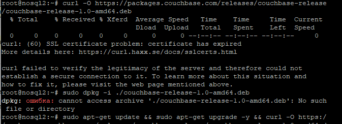

На двух машинах установка прошла успешно, но при установке на третьей возникла описанная ошибка.
Получается, что истёк сертификата у ресурса Couhbase (странное дело) в промежутке между установками на разные машины.
Или я ошибаюсь? Решение проблемы - ключ k в команде загрузки пакета:

```
curl -O -k https://packages.couchbase.com/releases/couchbase-release/couchbase-release-1.0-amd64.deb
```

Загрузил данные
travel-sample. Ниже представлено состояние кластера и базы данных (bucket).

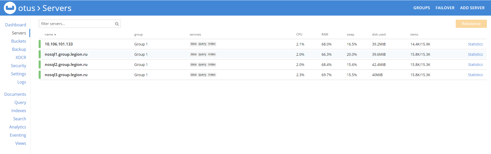

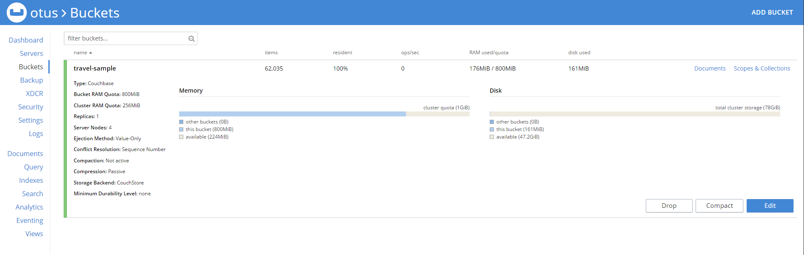

## Запросы на выборку данных

Согласно документации, попытался выполнить следующих запрос:
```
SELECT a.country FROM default:`travel-sample`.inventory.airline a
WHERE a.name = "Excel Airways";
```
Но получил отказ, с сообщением, что не создан первичный индекс (к сожалению, скриншот забыл сделать).
Помог Advice - соответствующая кнопка создания индекса любезно выведена на экран.

Результат запроса (выполнялся 1.9ms), как и описано в документации:
```
country
[
  {
    "country": "United Kingdom"
  }
]
```

Следующий запрос (из документации):
```
SELECT a.callsign FROM default:`travel-sample`.inventory.airline a LIMIT 5;
```
выполнился мгновенно (2.9ms):

```
[
  {
    "callsign": "MILE-AIR"
  },
  {
    "callsign": "TXW"
  },
  {
    "callsign": "atifly"
  },
  {
    "callsign": null
  },
  {
    "callsign": "LOCAIR"
  }
]
```

Следующий мой запрос:
```
select meta().id from `travel-sample`.`inventory`.`airport` data order by meta().id limit 10 offset 0
```
не выполнился:
```
[
  {
    "code": 4000,
    "msg": "Primary index def_inventory_airport_primary not online.",
    "query": "select meta().id from `travel-sample`.`inventory`.`airport` data order by meta().id limit 10 offset 0"
  }
]
```
Как следует из сообщения необходим индекс. Данный индекс существует, но находится в процессе построения:

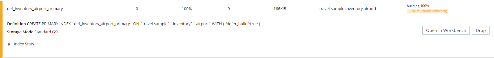

Смотрим состояние индекса:

```
SELECT * FROM system:indexes WHERE name="def_inventory_airport_primary";
```

```
[
  {
    "indexes": {
      "bucket_id": "travel-sample",
      "datastore_id": "http://127.0.0.1:8091",
      "id": "a42d30a108b9f536",
      "index_key": [],
      "is_primary": true,
      "keyspace_id": "airport",
      "name": "def_inventory_airport_primary",
      "namespace_id": "default",
      "scope_id": "inventory",
      "state": "building",
      "using": "gsi"
    }
  }
]
```
Такое впечатление, что построение индекса "залипло". Попытался принудительно завершить построение индекса:
```
BUILD INDEX ON `travel-sample`.`inventory`.`airport`(`def_inventory_airport_primary`, `def_inventory_airport_airportname`) USING GSI;
```

Не помогло. Пришлось удалить индекс и заново создать. Запрос заработал:

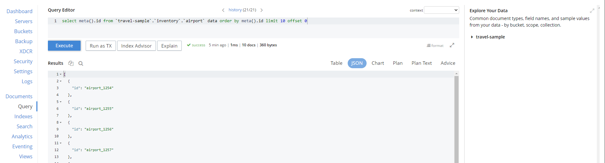

## Отказоустойчивость

Остановил процесс couchbase-server на nosql3:
```
sudo systemctl stop couchbase-server
```
Кластер отреагировал штатно:

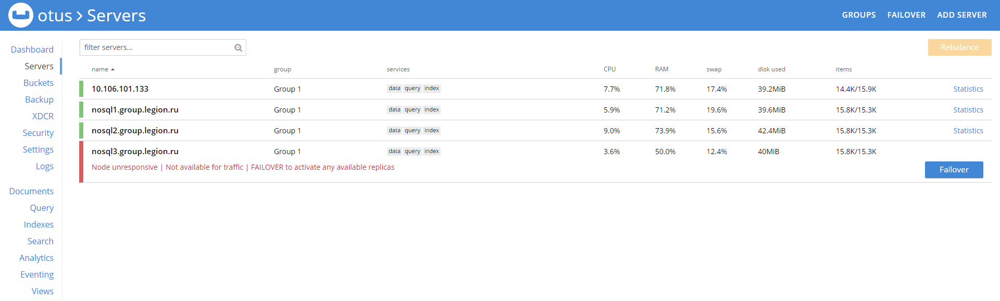

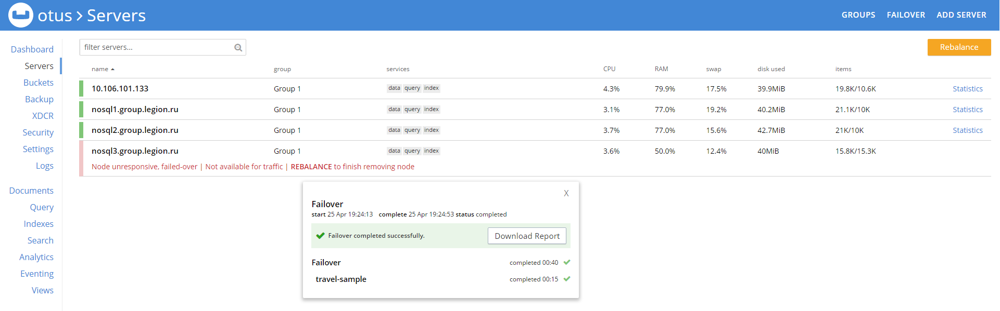

Произвёл Rebalance:

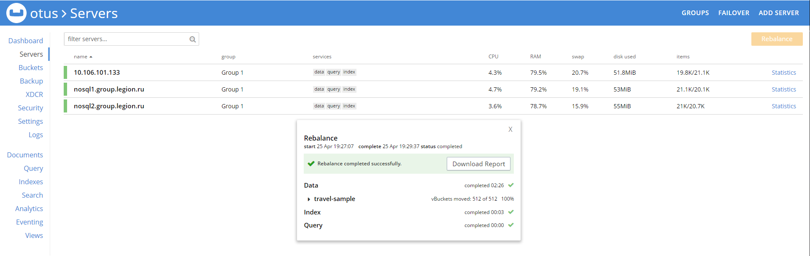

Проверка работоспособности кластера, выборка данных:

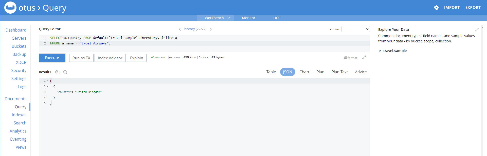

Восстановление узла nosql3:
```
sudo systemctl stop couchbase-server
```

Добавление узла:

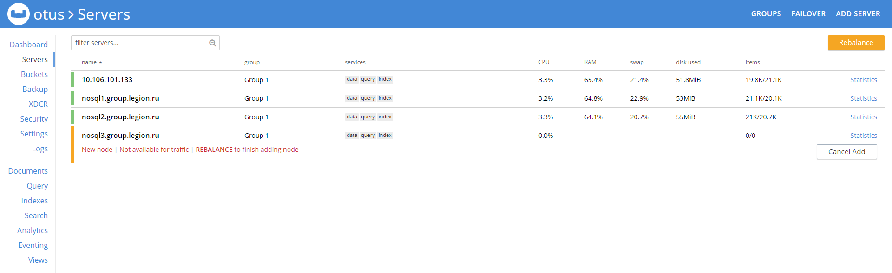

Ребалансировка:

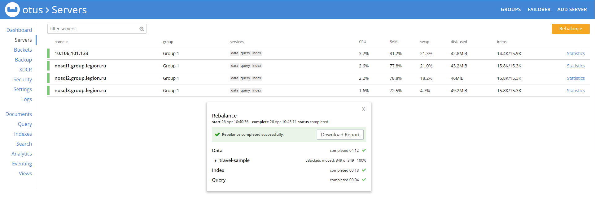
