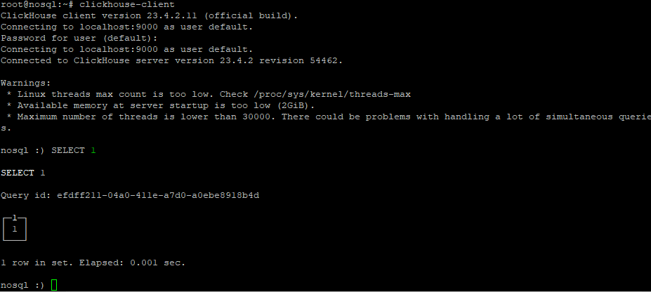
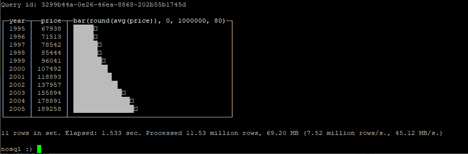
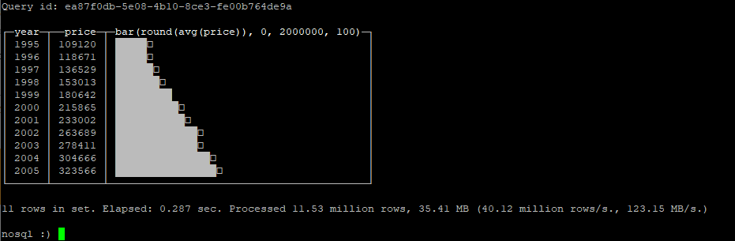
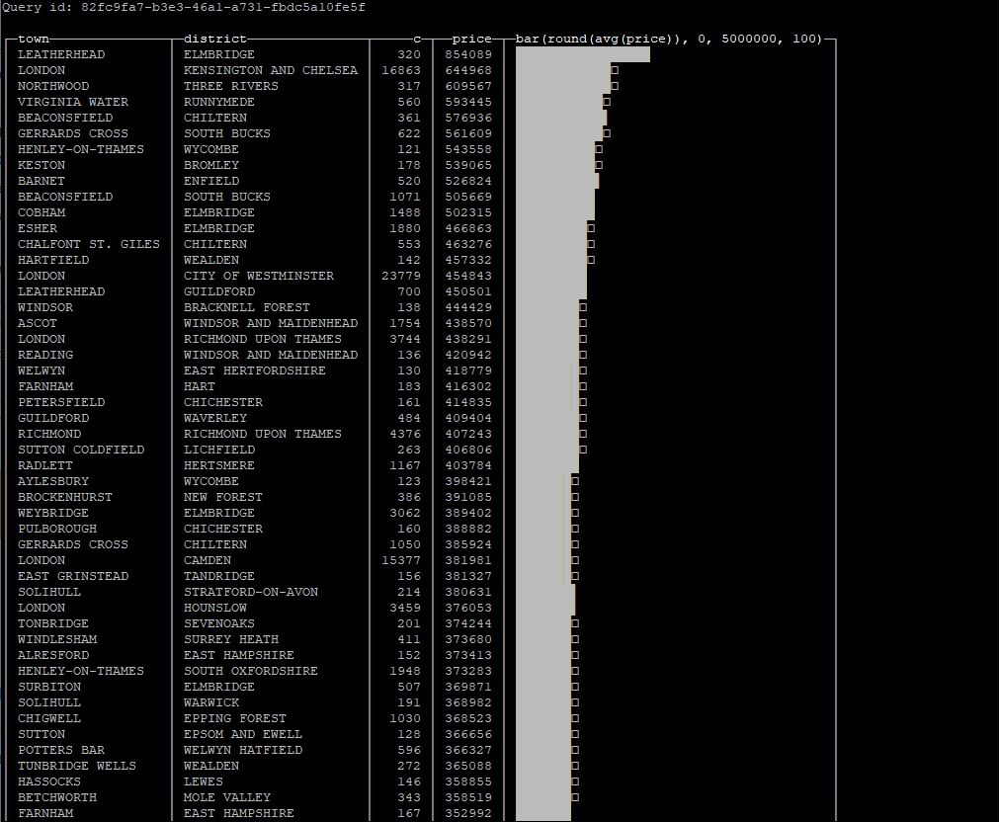
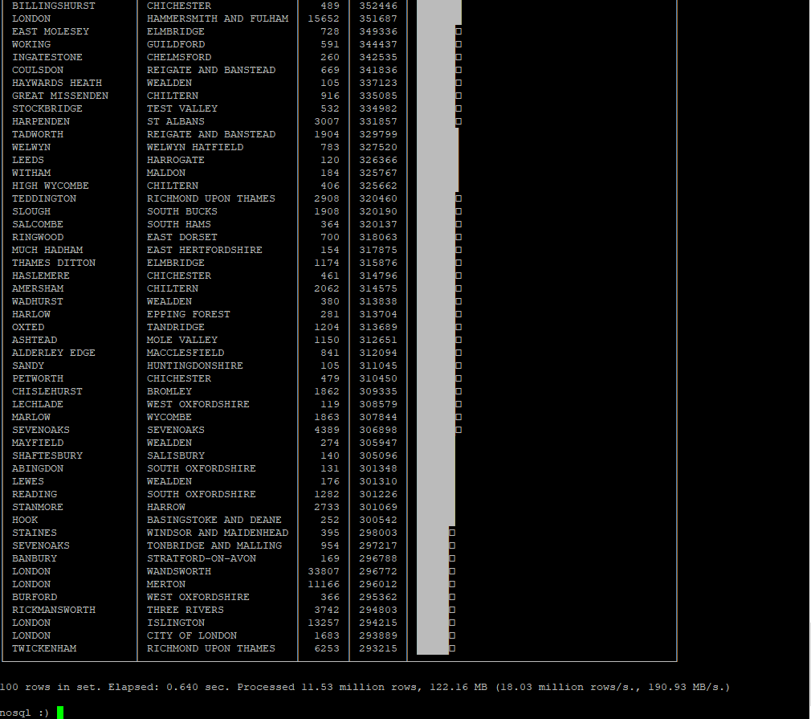

# Домашнее задание по теме "Clickhouse"

## Установка

Установку произвёл согласно [инструкции](https://clickhouse.com/docs/ru/getting-started/install)
Проверка работоспособности в соответствии с инструкцией:




## Загрузка тестовых данных

Данные загрузил с [ресурса](https://clickhouse.com/docs/en/getting-started/example-datasets/uk-price-paid)
- примерно 12 миллионов записей о стоимости недвижимости в UK. К сожалению, загрузить полностью датасет не получилось -
лимит на размер дискового пространства виртуальной машины. Загрузилось 75% от исходного датасета.

Проверка загруженных данных:


## Запросы

### Средняя цена по годам

Запрос:
```
SELECT
   toYear(date) AS year,
   round(avg(price)) AS price,
   bar(price, 0, 1000000, 80
)
FROM uk_price_paid
GROUP BY year
ORDER BY year
```

Результат:



### Средняя цена в Лондоне по годам

Запрос:
```
SELECT
   toYear(date) AS year,
   round(avg(price)) AS price,
   bar(price, 0, 2000000, 100
)
FROM uk_price_paid
WHERE town = 'LONDON'
GROUP BY year
ORDER BY year
```

Результат:



Скорость впечетляет - 287ms

### Самые дорогие районы

Запрос:
```
SELECT
    town,
    district,
    count() AS c,
    round(avg(price)) AS price,
    bar(price, 0, 5000000, 100)
FROM uk_price_paid
WHERE date >= '2001-01-01'
GROUP BY
    town,
    district
HAVING c >= 100
ORDER BY price DESC
LIMIT 100
```

Результат:




Опять же, запрос выполняется почти мгновенно - 640ms по 12 миллионам записей. И это с учётом
того, что запрос, с реляционной точки зрения, сложный - группировка и наличие HAVING.

