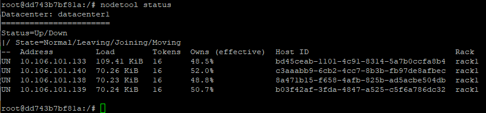
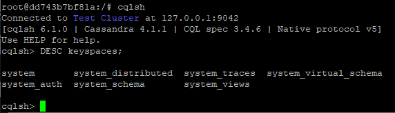
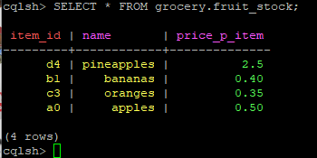
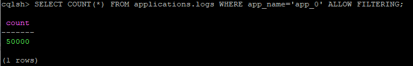
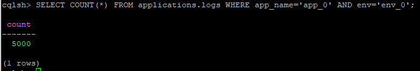
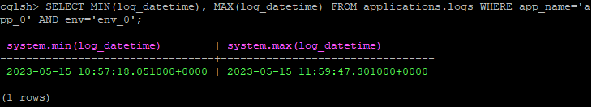
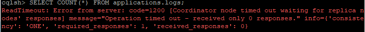
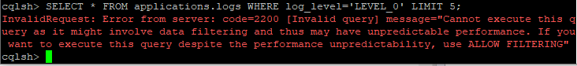
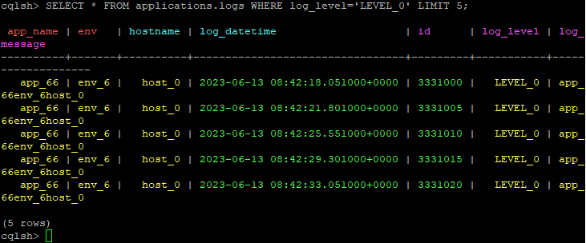

# Домашнее задание по теме "Масштабирование и отказоустойчивость Cassandra. Часть 1."

## Установка

Кластер Cassandra развёрнут на четырёх виртуальных машинах в [Docker-контейнерах](https://hub.docker.com/_/cassandra).
Команды установки (по одной на сервер):
```
docker run --name cassandra -d -e CASSANDRA_BROADCAST_ADDRESS=10.106.101.133 -p 7000:7000 -p 9042:9042 cassandra:latest
docker run --name cassandra -d -e CASSANDRA_BROADCAST_ADDRESS=10.106.101.138 -p 7000:7000 -p 9042:9042 -e CASSANDRA_SEEDS=10.106.101.133 cassandra:latest
docker run --name cassandra -d -e CASSANDRA_BROADCAST_ADDRESS=10.106.101.139 -p 7000:7000 -p 9042:9042 -e CASSANDRA_SEEDS=10.106.101.133 cassandra:latest
docker run --name cassandra -d -e CASSANDRA_BROADCAST_ADDRESS=10.106.101.140 -p 7000:7000 -p 9042:9042 -e CASSANDRA_SEEDS=10.106.101.133 cassandra:latest
```
Состояние кластера после равёртывания:





## Загрузка данных

### Простая таблица

Ниже приведены команды создания простой таблицы - только для проверки работоспособности кластера

```

CREATE KEYSPACE grocery WITH REPLICATION = {'class' : 'SimpleStrategy','replication_factor' : 2};
 
CREATE TABLE IF NOT EXISTS grocery.fruit_stock (item_id TEXT, name TEXT, price_p_item DECIMAL, PRIMARY KEY (item_id));
 
INSERT INTO grocery.fruit_stock (item_id, name, price_p_item) VALUES ('a0','apples',0.50);
INSERT INTO grocery.fruit_stock (item_id, name, price_p_item) VALUES ('b1','bananas',0.40);
INSERT INTO grocery.fruit_stock (item_id, name, price_p_item) VALUES ('c3','oranges',0.35);
INSERT INTO grocery.fruit_stock (item_id, name, price_p_item) VALUES ('d4','pineapples',2.5);

```

Проверочный запрос, что данные записаны:
```

SELECT * FROM grocery.fruit_stock;

```

Результат выполнения команды:



### Сложная таблица

Создание таблицы:

```

CREATE KEYSPACE applications WITH REPLICATION = {'class' : 'SimpleStrategy','replication_factor' : 2};

CREATE TABLE IF NOT EXISTS applications.logs (
    id INT,
    app_name VARCHAR,
    hostname VARCHAR,
    log_datetime TIMESTAMP,
    env VARCHAR,
    log_level VARCHAR,
    log_message TEXT,

    PRIMARY KEY ((app_name, env), hostname, log_datetime)
);

```

Заполнение указанной таблицы произведено с помощью мини-приложения Node.js (файл index.js). Загружено 5'000'000 записей.

Запросы:

1:



2:



3:



Запросы выполняются мгновенно.

4:



Последний запрос выполнился с ошибкой, как видно из скриншота. Добиться выполнения запроса не удалось (настройка тайм-аутов cqlsh
не помогла).

Для получения статистики, в том числе и количество строк в таблицах, необходимо использовать: 
```

nodetool cfstats

```

## Создание вторичного индекса

```

CREATE INDEX LOGLEVELIDX ON applications.logs (log_level);

```

Проверочный запрос:

Без индекса (выводится ошибка):



С индексом:



## Ресурсы

[Cassandra](https://cassandra.apache.org/_/index.html)

[Cassandra DataStax](https://docs.datastax.com/en/cassandra-oss/3.x/index.html)

[Установка кластера Cassandra на одной машине docker compose 1](https://gist.github.com/naumanbadar/aad6a25974b30adcb3c89b5f868627da)

[Установка кластера Cassandra на одной машине docker compose 2](https://kayaerol84.medium.com/cassandra-cluster-management-with-docker-compose-40265d9de076)

[Установка кластера Cassandra docker](https://hub.docker.com/_/cassandra)

[Ключ раздела Cassandra, составной ключ и ключ кластеризации](https://www.baeldung.com/cassandra-keys)

[DataStax Node.js Driver for Apache Cassandra](https://docs.datastax.com/en/developer/nodejs-driver/4.3/)

[Connect to Apache Cassandra with Node.js](https://www.instaclustr.com/support/documentation/cassandra/using-cassandra/connect-to-cassandra-with-node-js/)

[Статьи по Docker Network](https://accesto.com/blog/docker-networks-explained-part-1/)

[Статьи по Docker Network](https://accesto.com/blog/docker-networks-explained-part-2/)

[МОДЕЛЬ ДАННЫХ APACHE CASSANDRA](https://www.bigdataschool.ru/wiki/cassandra)

[ТОП-10 достоинств и 5 главных недостатков Apache Cassandra](https://www.bigdataschool.ru/blog/cassandra-key-features.html)

[Cassandra Docker](https://hub.docker.com/_/cassandra)
