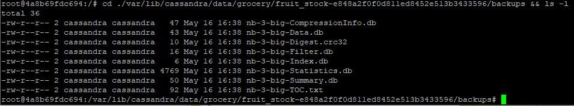

# Домашнее задание по теме "Масштабирование и отказоустойчивость Cassandra. Часть 2."

## Создание backup

Ниже представлены инструкции и резльтаты создания backup

Включение и проверка статуса backup
```

nodetool enablebackup
nodetool statusbackup

```
Состояние backup:


Создание backup:
```

nodetool flush grocery fruit_stock

```
Определение расположения состояния backup:
```

find -name backups

```

Полученные в результате выполнения процедуры backup файлы:



## Восстановление backup

Восстановление из backup:

```

nodetool import grocery fruit_stock /var/lib/cassandra/data/grocery/fruit_stock-e848a2f0f0d811ed8452e513b3433596/backups

```

Предварительно, я специально удалил keyspace grocery, с целью проверки процедуры восстановления. При восстановлении получил
сообщение об ошибке:
```

ColumnFamilyStore for grocery/fruit_stock not found.

```

Пришлось создать keyspace и таблицу. Такое поведение несколько удивило, поскольку я предполагал, что
backup сохранит метаданные, и в отсутствии keyspace и таблицы воссоздат их автоматически. Получается, что
если таблица удалена и её структура утеряна, то восстановить данные не представляется возможным.

Или я ошибаюсь?
