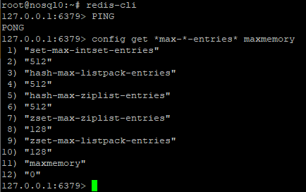

# Домашнее задание по теме "Redis"

## Установка Redis

Установка Redis поизведена в соотвествии с [инструкцией](https://redis.io/docs/getting-started/installation/install-redis-on-linux/).
Состояние Redis:



## Загрузка данных

Для загрузки данных было разработано Node.js мини-приложение. Для подключения к Redis использовался модуль
[ioredis](https://www.npmjs.com/package/ioredis). В качестве тестовых данных использовались данные об 
[инспекции городов](https://github.com/ozlerhakan/mongodb-json-files/blob/master/datasets/city_inspections.json).
Указанный ресурс использовался для загрузки данных во втором домашнем задании, посвящённом MongoDB. Размер JSON-файла
24 Mb, 81047 элементов. В данной работе рассмотрено два варианта загрузки данных: последовательный, команда за командой,
и с использование режима загрузки Pipeline, при котором команды собираются в исполняемый пакет. Загрузка производилась удалённо.

Ниже приведён пример элемента данных:
```

{
    "_id":{"$oid":"56d61033a378eccde8a8354f"},
    "id":"10021-2015-ENFO",
    "certificate_number":9278806,
    "business_name":"ATLIXCO DELI GROCERY INC.",
    "date":"Feb 20 2015",
    "result":"No Violation Issued",
    "sector":"Cigarette Retail Dealer - 127",
    "address": {
        "city":"RIDGEWOOD",
        "zip":11385,
        "street":"MENAHAN ST",
        "number":1712
    }
}

```

### Последовательная загрузка данных

Ниже приведён исходный код приложения для последовательной загрузки данных с использованием строк (для каждого атрибута свой ключ):

```

import { readFileSync } from 'fs';
import { Redis } from 'ioredis';

const redis = new Redis({
    port: 6379,
    host: "10.106.101.133",
});

const raw = readFileSync('city_inspections.json');
const data = JSON.parse(raw);

console.log(`Keys quantity:${data.length}`);
console.time();

for(let i = 0; i < data.length; i++) {
     await redis.set("city:" + data[i].id + ":certificate", data[i].certificate_number);
     await redis.set("city:" + data[i].id + ":businessname", data[i].business_name);
     await redis.set("city:" + data[i].id + ":date", data[i].date);
     await redis.set("city:" + data[i].id + ":result", data[i].result);
     await redis.set("city:" + data[i].id + ":sector", data[i].sector);
}

console.timeEnd();

```

Время загрузки: 156.613s

Исходный код для загрузки данных с использование hash-таблиц:

```

import { readFileSync } from 'fs';
import { Redis } from 'ioredis';

const redis = new Redis({
    port: 6379,
    host: "10.106.101.133",
});

const raw = readFileSync('city_inspections.json');
const data = JSON.parse(raw);

console.log(`Keys quantity:${data.length}`);
console.time();

for(let i = 0; i < data.length; i++) {
    await redis.hset("city:" + data[i].id,
        {
            certificate: data[i].certificate_number,
            businessname: data[i].business_name,
            date: data[i].date,
            result: data[i].result,
            sector: data[i].sector
        }
    );
}

console.timeEnd();

```

Время загрузки: 31.324s.

### Загрузка данных с использованием Pipeline

Ниже приведён код загрузки данных, строки и hash-таблицы, но с использованием pipeline:

```

import { readFileSync } from 'fs';
import { Redis } from 'ioredis';

const redis = new Redis({
    port: 6379,
    host: "10.106.101.133",
});

const raw = readFileSync('city_inspections.json');
const data = JSON.parse(raw);

console.log(`Keys quantity:${data.length}`);

for(let i = 0; i < data.length; i++) {
    await pipeline.set("city:" + data[i].id + ":certificate", data[i].certificate_number);
    await pipeline.set("city:" + data[i].id + ":businessname", data[i].business_name);
    await pipeline.set("city:" + data[i].id + ":date", data[i].date);
    await pipeline.set("city:" + data[i].id + ":result", data[i].result);
    await pipeline.set("city:" + data[i].id + ":sector", data[i].sector);
}

console.time();

await pipeline.exec();

console.timeEnd();

```

Время загрузки: 1.468s

```

import { readFileSync } from 'fs';
import { Redis } from 'ioredis';

const redis = new Redis({
    port: 6379,
    host: "10.106.101.133",
});

const raw = readFileSync('city_inspections.json');
const data = JSON.parse(raw);

console.log(`Keys quantity:${data.length}`);

for(let i = 0; i < data.length; i++) {
    await pipeline.hset("city:" + data[i].id,
        {
            certificate: data[i].certificate_number,
            businessname: data[i].business_name,
            date: data[i].date,
            result: data[i].result,
            sector: data[i].sector
        }
    );
}

console.time();

await pipeline.exec();

console.timeEnd();

```

Время загрузки: 1.096s

Важно отметить, что использвание pipeline драматически ускорило процесс загрузки данных.

## Временные параметры чтения

Оценка времени чтения по заданному ключу: 10000 чтений за 3.774s (0.3774ms)
