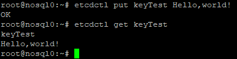
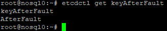

# Домашнее задание по теме "DCS"

## Установка кластера etcd

Установка etcd поизведена в соотвествии с [инструкцией](https://facsiaginsa.com/etcd/how-to-setup-etcd-cluster).
Состояние кластера etcd:


Команды получения состояния кластера:

```
etcdctl member list -w table
ENDPOINTS=$(etcdctl member list | grep -o '[^ ]\+:2379' | paste -s -d,)
etcdctl endpoint status --endpoints=$ENDPOINTS -w table

```

## Проверка чтения/записи

Ниже представлен скриншот выполнения команд записи и чтения:



Чтение на другом узле:


## Проверка отказоустойчивости

Остановил узел (nosql0), являющийся лидером. Состояние кластера, с новым лидером:


Чтение и запись выполняются (на узле nosql1):


Восстановление узла (nosql0):


Проверка консистетности данных на восстановлённом узле:



Значение по ключу keyAfterFault было записано после отключения узла, и
успешно прочитано на восстановленном узле.
