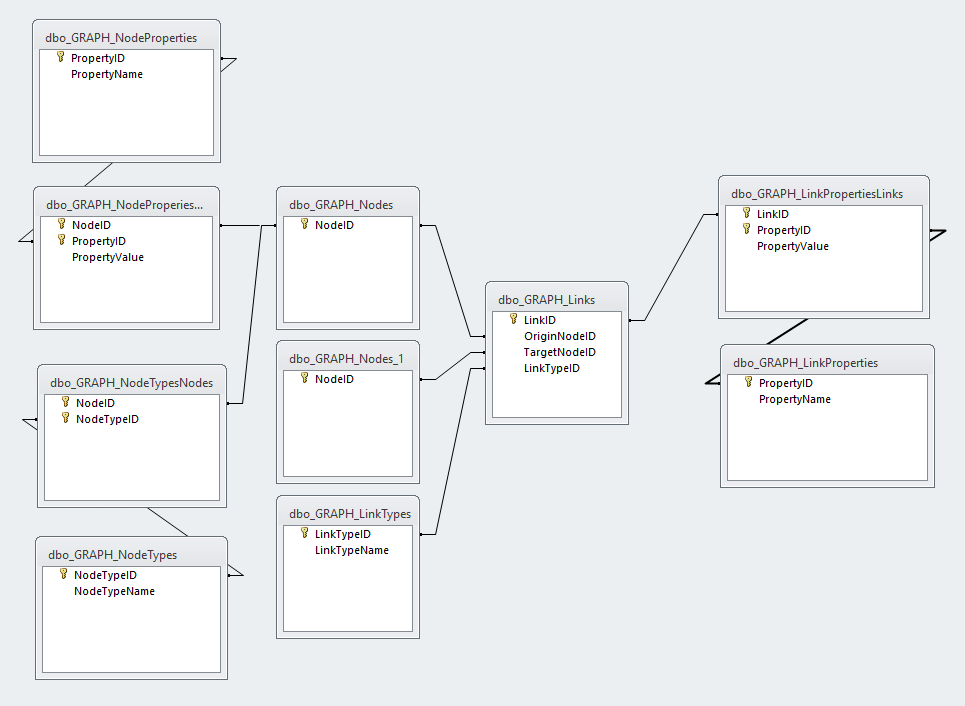

# Домашнее задание на тему "Сравнение с неграфовыми БД"

В данной работе будет проводится сравнение с MS SQL Server. В [книге](https://dmkpress.com/catalog/computer/databases/978-5-97060-201-0/),
посвящённой neo4j, упоминается, что возникновение neo4j было обусловлено, в том числе, и неудачными попытками реализовать графовую модель
средствами реляционной базы данных. Под средствами реляционной СУБД не подразумеваются специализированные расширения СУБД поддержки графовых моделей. Для MS SQL Server такие [средства](https://www.red-gate.com/simple-talk/databases/sql-server/t-sql-programming-sql-server/sql-server-graph-databases-part-1-introduction/) реализованы и поддерживаются с 2017 года. Но, вполне возможно реализовать простые случаи графов нативными средствами реляционной СУБД. Например, иерархические структуры - деревья. Запросы для работы с деревьями вполне понятны и просты, благодаря рекурсивным CTE (common table expressions). Но в целом, реализовать
нативными средствами реляционной СУБД полноценную поддержку графовой модели, с обеспечением хорошего уровня производительности для графов с миллиардами узлов, вряд ли
возможно. Преодоление семантического разрыва между табличной и графовой парадигмами может превратится в неразрешимую задачу - надо ещё формально доказать, что реляционное и графовое представления изоморфны. 

## Базовые таблицы

### Таблица узлов

Таблица узлов содержит идентификаторы узлов, входящих в описание графа. Узлы вынесены в отдельную таблицу поскольку
необходимо иметь возможность задавать метки (здесь используется тип узла) и свойства для каждого конкретного узла.

```

CREATE TABLE [dbo].[GRAPH_Nodes](
	[NodeID] [int] IDENTITY(1,1) NOT NULL,
 CONSTRAINT [PK_GRAPH_Nodes] PRIMARY KEY CLUSTERED 
(
	[NodeID] ASC
)WITH (PAD_INDEX = OFF, STATISTICS_NORECOMPUTE = OFF, IGNORE_DUP_KEY = OFF, ALLOW_ROW_LOCKS = ON, ALLOW_PAGE_LOCKS = ON) ON [PRIMARY]
) ON [PRIMARY]
GO

```

### Таблица типов узлов (меток узлов)

Таблица типов узлов - это возможные метки для узлов в графе. Один узел может быть помечен несколькими метками - т.е. связан с несколькими различными типами (таблица **GRAPH_NodeTypesNodes** - см. ниже)

```

CREATE TABLE [dbo].[GRAPH_NodeTypes](
	[NodeTypeID] [int] NOT NULL,
	[NodeTypeName] [nvarchar](255) NOT NULL,
 CONSTRAINT [PK_GRAPH_NodeTypes] PRIMARY KEY CLUSTERED 
(
	[NodeTypeID] ASC
)WITH (PAD_INDEX = OFF, STATISTICS_NORECOMPUTE = OFF, IGNORE_DUP_KEY = OFF, ALLOW_ROW_LOCKS = ON, ALLOW_PAGE_LOCKS = ON) ON [PRIMARY],
 CONSTRAINT [IX_GRAPH_NodeTypes] UNIQUE NONCLUSTERED 
(
	[NodeTypeName] ASC
)WITH (PAD_INDEX = OFF, STATISTICS_NORECOMPUTE = OFF, IGNORE_DUP_KEY = OFF, ALLOW_ROW_LOCKS = ON, ALLOW_PAGE_LOCKS = ON) ON [PRIMARY]
) ON [PRIMARY]
GO

```

### Таблица связанных типов (меток) с узлами

Таблица содержит метки конкретных узлов

```

CREATE TABLE [dbo].[GRAPH_NodeTypesNodes](
	[NodeID] [int] NOT NULL,
	[NodeTypeID] [int] NOT NULL,
 CONSTRAINT [PK_GRAPH_NodeTypesNodes] PRIMARY KEY CLUSTERED 
(
	[NodeID] ASC,
	[NodeTypeID] ASC
)WITH (PAD_INDEX = OFF, STATISTICS_NORECOMPUTE = OFF, IGNORE_DUP_KEY = OFF, ALLOW_ROW_LOCKS = ON, ALLOW_PAGE_LOCKS = ON) ON [PRIMARY]
) ON [PRIMARY]
GO

ALTER TABLE [dbo].[GRAPH_NodeTypesNodes]  WITH CHECK ADD  CONSTRAINT [FK_GRAPH_NodeTypesNodes_GRAPH_Nodes] FOREIGN KEY([NodeID])
REFERENCES [dbo].[GRAPH_Nodes] ([NodeID])
GO

ALTER TABLE [dbo].[GRAPH_NodeTypesNodes] CHECK CONSTRAINT [FK_GRAPH_NodeTypesNodes_GRAPH_Nodes]
GO

ALTER TABLE [dbo].[GRAPH_NodeTypesNodes]  WITH CHECK ADD  CONSTRAINT [FK_GRAPH_NodeTypesNodes_GRAPH_NodeTypes] FOREIGN KEY([NodeTypeID])
REFERENCES [dbo].[GRAPH_NodeTypes] ([NodeTypeID])
GO

ALTER TABLE [dbo].[GRAPH_NodeTypesNodes] CHECK CONSTRAINT [FK_GRAPH_NodeTypesNodes_GRAPH_NodeTypes]
GO

```
### Таблица типов свойств узлов

Таблица содержит допустимые типы свойств узлов. За скобками остался вопрос о типе свойства: int, bit, nvarchar и т.д. Я не стал это реализовывать, поскольку схема базы данных и без того получается развесистой. В данной релизации предполагается, что значения свойств имеют тип *nvarchar(4000)*.

```

CREATE TABLE [dbo].[GRAPH_NodeProperties](
	[PropertyID] [int] IDENTITY(1,1) NOT NULL,
	[PropertyName] [nvarchar](255) NOT NULL,
 CONSTRAINT [PK_GRAPH_NodeProperties] PRIMARY KEY CLUSTERED 
(
	[PropertyID] ASC
)WITH (PAD_INDEX = OFF, STATISTICS_NORECOMPUTE = OFF, IGNORE_DUP_KEY = OFF, ALLOW_ROW_LOCKS = ON, ALLOW_PAGE_LOCKS = ON) ON [PRIMARY]
) ON [PRIMARY]
GO

```

### Таблица свойств конкретных узлов

Таблица содержит конкретные значения свойств конкретных узлов

```

CREATE TABLE [dbo].[GRAPH_NodeProperiesNodes](
	[NodeID] [int] NOT NULL,
	[PropertyID] [int] NOT NULL,
	[PropertyValue] [nvarchar](4000) NOT NULL,
 CONSTRAINT [PK_GRAPH_NodeProperiesNodes] PRIMARY KEY CLUSTERED 
(
	[NodeID] ASC,
	[PropertyID] ASC
)WITH (PAD_INDEX = OFF, STATISTICS_NORECOMPUTE = OFF, IGNORE_DUP_KEY = OFF, ALLOW_ROW_LOCKS = ON, ALLOW_PAGE_LOCKS = ON) ON [PRIMARY]
) ON [PRIMARY]
GO

ALTER TABLE [dbo].[GRAPH_NodeProperiesNodes]  WITH CHECK ADD  CONSTRAINT [FK_GRAPH_NodeProperiesNodes_GRAPH_NodeProperties] FOREIGN KEY([PropertyID])
REFERENCES [dbo].[GRAPH_NodeProperties] ([PropertyID])
GO

ALTER TABLE [dbo].[GRAPH_NodeProperiesNodes] CHECK CONSTRAINT [FK_GRAPH_NodeProperiesNodes_GRAPH_NodeProperties]
GO

```

### Таблица типов связей

```

CREATE TABLE [dbo].[GRAPH_LinkTypes](
	[LinkTypeID] [int] IDENTITY(1,1) NOT NULL,
	[LinkTypeName] [nvarchar](255) NOT NULL,
 CONSTRAINT [PK_GRAPH_LinkTypes] PRIMARY KEY CLUSTERED 
(
	[LinkTypeID] ASC
)WITH (PAD_INDEX = OFF, STATISTICS_NORECOMPUTE = OFF, IGNORE_DUP_KEY = OFF, ALLOW_ROW_LOCKS = ON, ALLOW_PAGE_LOCKS = ON) ON [PRIMARY],
 CONSTRAINT [IX_GRAPH_LinkTypes] UNIQUE NONCLUSTERED 
(
	[LinkTypeName] ASC
)WITH (PAD_INDEX = OFF, STATISTICS_NORECOMPUTE = OFF, IGNORE_DUP_KEY = OFF, ALLOW_ROW_LOCKS = ON, ALLOW_PAGE_LOCKS = ON) ON [PRIMARY]
) ON [PRIMARY]
GO

```

### Таблица допустимых свойств связей

```

CREATE TABLE [dbo].[GRAPH_LinkProperties](
	[PropertyID] [int] IDENTITY(1,1) NOT NULL,
	[PropertyName] [nvarchar](255) NOT NULL,
 CONSTRAINT [PK_GRAPH_LinkProperties] PRIMARY KEY CLUSTERED 
(
	[PropertyID] ASC
)WITH (PAD_INDEX = OFF, STATISTICS_NORECOMPUTE = OFF, IGNORE_DUP_KEY = OFF, ALLOW_ROW_LOCKS = ON, ALLOW_PAGE_LOCKS = ON) ON [PRIMARY],
 CONSTRAINT [IX_GRAPH_LinkProperties] UNIQUE NONCLUSTERED 
(
	[PropertyName] ASC
)WITH (PAD_INDEX = OFF, STATISTICS_NORECOMPUTE = OFF, IGNORE_DUP_KEY = OFF, ALLOW_ROW_LOCKS = ON, ALLOW_PAGE_LOCKS = ON) ON [PRIMARY]
) ON [PRIMARY]
GO

```
### Таблица значений конкретных свойств конкретных связей

Поле LinkID - конкретная связь между конкрентными узлами графа (таблица **GRAPH_Links** - см. ниже)

```

CREATE TABLE [dbo].[GRAPH_LinkPropertiesLinks](
	[LinkID] [int] NOT NULL,
	[PropertyID] [int] NOT NULL,
	[PropertyValue] [nvarchar](4000) NOT NULL,
 CONSTRAINT [PK_GRAPH_LinkPropertiesLinks] PRIMARY KEY CLUSTERED 
(
	[LinkID] ASC,
	[PropertyID] ASC
)WITH (PAD_INDEX = OFF, STATISTICS_NORECOMPUTE = OFF, IGNORE_DUP_KEY = OFF, ALLOW_ROW_LOCKS = ON, ALLOW_PAGE_LOCKS = ON) ON [PRIMARY]
) ON [PRIMARY]
GO

ALTER TABLE [dbo].[GRAPH_LinkPropertiesLinks]  WITH CHECK ADD  CONSTRAINT [FK_GRAPH_LinkPropertiesLinks_GRAPH_LinkProperties] FOREIGN KEY([PropertyID])
REFERENCES [dbo].[GRAPH_LinkProperties] ([PropertyID])
GO

ALTER TABLE [dbo].[GRAPH_LinkPropertiesLinks] CHECK CONSTRAINT [FK_GRAPH_LinkPropertiesLinks_GRAPH_LinkProperties]
GO

```

### Таблица графов

Ключ таблицы - идентификатор связи между узлами графа: *OriginNodeID* и *TargetNodeID*. Поле *LinkTypeID* - тип (метка) связи. У связи может быть только одна метка.
Свойства узлов, задаваемых полями *OriginNodeID* и *TargetNodeID*, опрделяются в таблице **GRAPH_NodeProperiesNodes**.

```

CREATE TABLE [dbo].[GRAPH_Links](
	[LinkID] [int] IDENTITY(1,1) NOT NULL,
	[OriginNodeID] [int] NOT NULL,
	[TargetNodeID] [int] NOT NULL,
	[LinkTypeID] [int] NOT NULL,
 CONSTRAINT [PK_GRAPH_Links] PRIMARY KEY CLUSTERED 
(
	[LinkID] ASC
)WITH (PAD_INDEX = OFF, STATISTICS_NORECOMPUTE = OFF, IGNORE_DUP_KEY = OFF, ALLOW_ROW_LOCKS = ON, ALLOW_PAGE_LOCKS = ON) ON [PRIMARY]
) ON [PRIMARY]
GO

ALTER TABLE [dbo].[GRAPH_Links]  WITH CHECK ADD  CONSTRAINT [FK_GRAPH_Links_GRAPH_LinkTypes] FOREIGN KEY([LinkTypeID])
REFERENCES [dbo].[GRAPH_LinkTypes] ([LinkTypeID])
GO

ALTER TABLE [dbo].[GRAPH_Links] CHECK CONSTRAINT [FK_GRAPH_Links_GRAPH_LinkTypes]
GO

ALTER TABLE [dbo].[GRAPH_Links]  WITH CHECK ADD  CONSTRAINT [FK_GRAPH_Links_GRAPH_Nodes] FOREIGN KEY([OriginNodeID])
REFERENCES [dbo].[GRAPH_Nodes] ([NodeID])
GO

ALTER TABLE [dbo].[GRAPH_Links] CHECK CONSTRAINT [FK_GRAPH_Links_GRAPH_Nodes]
GO

ALTER TABLE [dbo].[GRAPH_Links]  WITH CHECK ADD  CONSTRAINT [FK_GRAPH_Links_GRAPH_Nodes1] FOREIGN KEY([TargetNodeID])
REFERENCES [dbo].[GRAPH_Nodes] ([NodeID])
GO

ALTER TABLE [dbo].[GRAPH_Links] CHECK CONSTRAINT [FK_GRAPH_Links_GRAPH_Nodes1]
GO

```

### Схема базы данных

Ниже представлена схема Базы Данных




