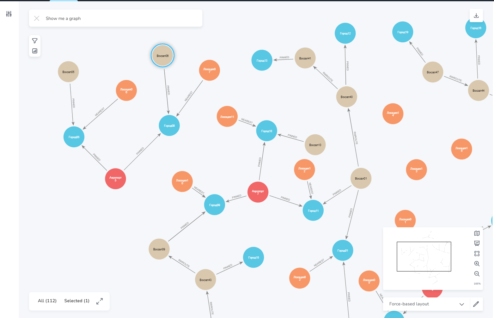

# Домашнее задание на тему "Использование neo4j"

## Введение

Я попробовал найти найти туроператоров и предоставляемые ими путёвки в интернете. Но в какой-то момент понял, что
это утомительно, и может занять продолжительное время. Поэтому я решил несколько упростить задачу: сформировать граф
из вымышленных туроператоров и маршрутов. Тем не менее, это позволит продемонстрировать владение изученным на лекциях
материалом. Надеюсь на Вашу благосклонность, уважаемый преподаватель.

## Граф приложения

### Узлы

Для моделирования предметной области будут использованы следующие типы узлов:

- **TUROP**. Туроператор
- **COUNTRY**. Страна размещения конкретного места
- **LOC**. Конкретное место (локация)
- **CITY**. Город. В том числе и ближайший к конкретному месту
- **AP**. Аэропорт
- **RWS**. Железнодорожный вокзал

### Связи

- **LOCATE**. Связывает страну (COUNTRY) с конкретным местом (LOC)
- **PROVIDE**. Предоставление путёвки оператором. Связывает узлы COUNTRY и TOUROP
- **NEAREST**. Связывает конкретное место (LOC) и ближайший город (CITY) 
- **RWROUTE**. Связывает два города (CITY), имеющих железнодорожное сообщение
- **AWROUTE**. Связывает два города (CITY), имеющих воздушное сообщение
- **PINNED**. Аэропорт или вокзал, связанные с городом

### Фрагмента графа

Для решения домашнего задания использовалась среда разработки Meo4j AuraDB. Файлы данных для загрузки размещены
в данном репозитории: *Task12.\*.csv*.
Ниже представлен фрагмент графа. Не показаны узлы туроператоров, стран, связи воздушного сообщения. Лишние
узлы пришлось убрать, поскольку при отображении полного графа в AuraDB появляются проблемы.

