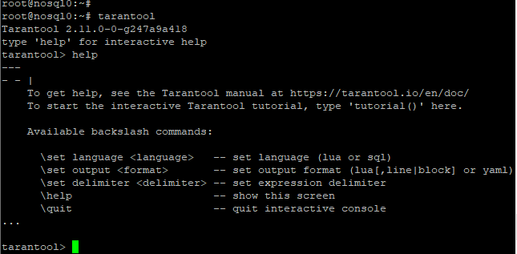
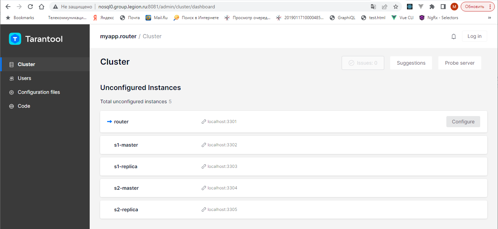
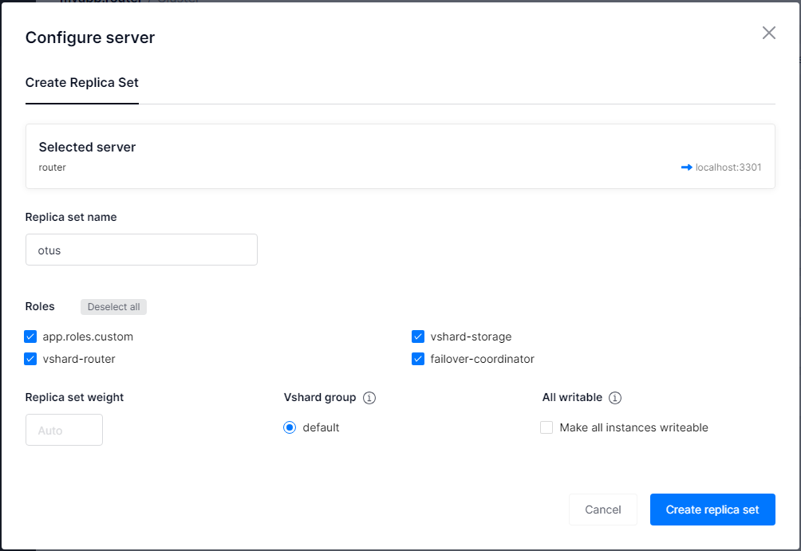
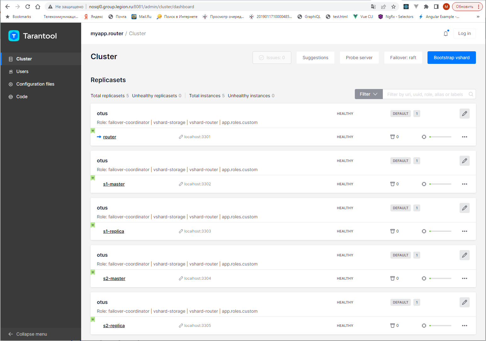

# Домашнее задание на тему "Работа с tarantool"

## Установка Tarantool

Установка Tarantool произведена в соответствии с [инструкцией](https://www.tarantool.io/en/download/os-installation/ubuntu/).
Проверка успешного выполнения установки:

## Соэдание приложения кластера Tarantool

Установка cartrige-cli произведена в соответствии с [инструкцией](https://www.tarantool.io/ru/doc/latest/book/cartridge/cartridge_cli/installation/).
Создание приложения и кластера произведено в соответствии с [инструкцией](https://www.tarantool.io/ru/doc/latest/how-to/getting_started_cartridge/).

Начальное состояние кластера:

Настройки реплик:

Состояние кластера после выполнения конфигурирования:

