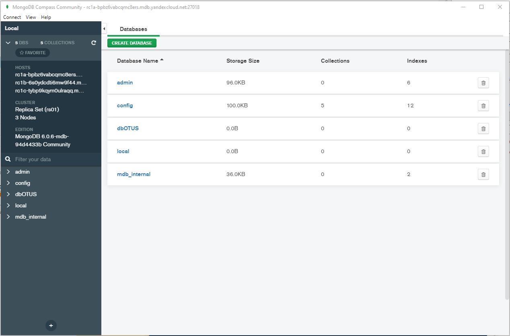
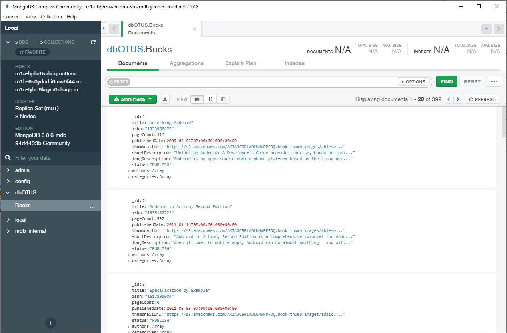
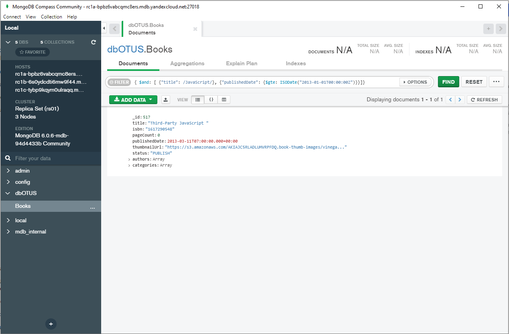

# Домашнее задание на тему "Облака"

## Настройка MongoDB-кластера в YandexCloud

Настройка MongoDB-кластера произведена в соответствии с (инструкцией)[https://cloud.yandex.ru/docs/managed-mongodb/operations/cluster-list].

Кластер собран из 3-х нешардированных реплик. Подключение к кластеру осуществлялось с помощью MongoDB Compass Community.
На скриншоте ниже представлено состояние кластера.

## Загрузка данных

Загрузил данные о книгах с предложенного [ресурса](https://github.com/ozlerhakan/mongodb-json-files). Загрузку произвёл средствами
импорта данных MongoDB Compass Community. Состояние после загрузки:

Надо признать, что загрузка данных прошла достаточно быстро.

## Запросы на выборку
### Запрос на выборку книг по JavaScript, выпущенных начиная с 01.01.2013 включительно

### Запрос на выборку книг, автором которых, является Robi Sen

Запросы выполняются мгновенно, заметного замедления выполнения запросов не наблюдалось.
